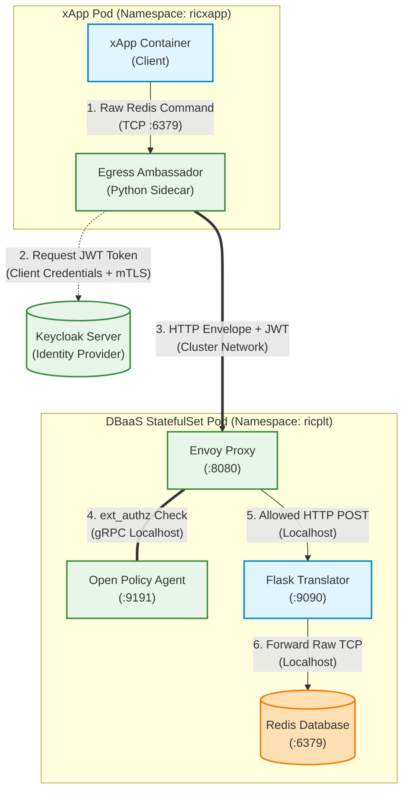

# Centralized PEP approach as Zero Trust Fortress Architecture for O-RAN Shared Data Layer (SDL)

## Overview
The Zero Trust Fortress Architecture is a highly optimized, framework designed to protect the O-RAN Shared Data Layer (Redis DBaaS). It enforces Attribute-Based Access Control (ABAC) and cryptographic verification on every database transaction without requiring any source-code modifications to the existing xApps or the core Redis database.

By utilizing a sidecar proxy pattern and injecting the Policy Enforcement Point (PEP) directly into the database pod (the "Fortress" pattern), this architecture achieves deep packet inspection with minimal network latency overhead.


xApp pod contains 3 containers. 
1. xApp container
   - Hosts the core xApp application logic. 
2. Egress-Ambassador (Client-Side Python sidecar proxy)
   - Acts as a secure proxy for inbound and outbound traffic.
   - Periodically fetches and caches the JWT from Keycloak.
   - Intercepts raw TCP database traffic (RESP protocol) from the xApp.
   - Wraps the raw bytes into a Base64-encoded HTTP POST body, attaches the JWT as a Bearer token, and forwards it across the cluster network.

The standard OSC RIC DBaaS StatefulSet is patched to include three critical security containers running alongside the Redis database. As a result, DBaaS Pod contains 4 containers. 

1. Envoy Proxy
    - Acts as the network perimeter. It intercepts the HTTP envelope and initiates an external authorization (`ext_authz`) gRPC call.

2. Open Policy Agent (OPA)
    - The policy brain. It decodes the JWT and the Base64 Redis payload. It executes Rego logic to ensure the requested database operation (e.g., MGET, SET) strictly matches the permissions assigned in the token claims.
3. Protocol Translator
    - If OPA approves the request, Envoy forwards the HTTP envelope to a Flask microservice. This service strips the HTTP headers and sends the raw TCP payload directly to the Redis container via the pod's internal `localhost` interface.

## Request Lifecycle & Traffic Flow
1. Initiation: The xApp executes a database command (e.g., MSET).

2. Interception: Traffic is routed to 127.0.0.1:6379, where the Egress Ambassador catches it.

3. Encapsulation: The Ambassador retrieves its cached Keycloak JWT, packages the TCP bytes into an HTTP POST request, and sends it to secure-dbaas-service.ricplt.svc.cluster.local:8080.

4. Authorization: Envoy intercepts the request and asks OPA for permission.

5. ABAC Validation: OPA extracts the sdl_ops and x_sdl_action claims. It verifies that the action requested inside the Base64 payload mathematically matches the assigned capabilities. Handshake commands (e.g., PING) are automatically permitted.

6. Translation: Upon a successful 200 OK from OPA, Envoy routes traffic to the Protocol Translator.

7. Execution: The Translator extracts the TCP body and pushes it to Redis on 127.0.0.1:6379. The response travels back up the chain to the xApp.


## Architecture Diagram




# Implemenation Steps

Deploy the Keycloak server as described in keycloak.md

## Cert-Manager Setup & PKI Configuration

In our Zero Trust O-RAN architecture, **cert-manager** acts as the automated Public Key Infrastructure (PKI) engine inside the Kubernetes cluster. It is responsible for dynamically minting, delivering, and managing X.509 Mutual TLS (mTLS) certificates for every xApp deployed in the RIC. 

By integrating `cert-manager` with our Kyverno automation pipeline, we achieve a "Zero-Touch" identity provisioning system, completely decoupling security management from xApp development.

Cert-manager was deployed into the cluster using its standard Kubernetes manifests. This creates the necessary Custom Resource Definitions (CRDs) and the background controllers.

```bash
# Create the cert-manager namespace and install the stack
sudo kubectl apply -f https://github.com/cert-manager/cert-manager/releases/download/v1.13.2/cert-manager.yaml
```
Wait until all pods are running. check pod status using this command.
```bash
sudo kubectl get pods -n cert-manager
```

create SMO root certificate as a kube secret within `cert-manager` namespace.
```bash
sudo kubectl create secret tls smo-root-ca-secret \
  --cert=ca.crt \
  --key=ca.key \
  --namespace=cert-manager
```

Apply cluster issuer for issue xApp certificates via cert-manager. create smo-issuer.yaml
```bash
apiVersion: cert-manager.io/v1
kind: ClusterIssuer
metadata:
  name: smo-root-ca
spec:
  ca:
    secretName: smo-root-ca-secret

```
Apply it to the RIC Cluster:
```bash
sudo kubectl apply -f smo-cluster-issuer.yaml
```

```bash
kubectl get clusterissuer smo-root-ca -o wide
```
Expected Output: `READY = True`

## Update the Core ConfigMaps
We need to recreate the ConfigMaps. Because everything is now running inside the exact same pod as Redis, Envoy and the Translator will communicate with Redis over 127.0.0.1.

Create and apply this file named `fortress-opa-policy.yaml`:

```bash
apiVersion: v1
kind: ConfigMap
metadata:
  name: fortress-opa-policy
  namespace: ricplt
data:
  policy.rego: |
    package envoy.authz

    default allow = true

    # 1. Decode JWT
    decoded_token = payload {
        auth_header := input.attributes.request.http.headers.authorization
        startswith(auth_header, "Bearer ")
        jwt := substring(auth_header, 7, -1)
        [_, payload, _] := io.jwt.decode(jwt)
    }

    # 2. Decode Envoy's Base64 Payload
    redis_payload = decoded_body {
        raw_body := input.attributes.request.http.body
        decoded_body := base64.decode(raw_body)
    }

    # 3. Normalize for case-insensitivity and safely stringify Keycloak claims
    upper_payload = upper(redis_payload)
    token_ops = json.marshal(decoded_token.sdl_ops)
    token_action = json.marshal(decoded_token.x_sdl_action)

    # RULE 1: Allow basic Redis handshakes (Crucial for connection establishment)
    allow {
        decoded_token # Enforce that they at least have a valid Keycloak token
        handshake_commands := ["PING", "HELLO", "COMMAND", "INFO", "QUIT"]
        contains(upper_payload, handshake_commands[_])
    }

    # RULE 2: ABAC Write Action
    allow {
        contains(token_ops, "write")
        contains(token_action, "SET")
        contains(upper_payload, "SET")
    }

    # RULE 3: ABAC Read Action (Forgiving)
    allow {
        contains(token_ops, "read")
        # Allow either GET or MGET
        is_read_command(upper_payload)
    }

    is_read_command(payload) {
        contains(payload, "GET")
    }
    is_read_command(payload) {
        contains(payload, "MGET")
    }

```

Create and apply this file named `fortress-configs.yaml`:

```bash
apiVersion: v1
kind: ConfigMap
metadata:
  name: fortress-envoy-config
  namespace: ricplt
data:
  envoy.yaml: |
    static_resources:
      listeners:
      - name: gateway_listener
        address:
          socket_address: { address: 0.0.0.0, port_value: 8080 }
        filter_chains:
        - filters:
          - name: envoy.filters.network.http_connection_manager
            typed_config:
              "@type": type.googleapis.com/envoy.extensions.filters.network.http_connection_manager.v3.HttpConnectionManager
              stat_prefix: ingress_http
              
              # ADDED: This will print every single request to Envoy's logs!
              access_log:
              - name: envoy.access_loggers.stdout
                typed_config:
                  "@type": type.googleapis.com/envoy.extensions.access_loggers.stream.v3.StdoutAccessLog
                  
              route_config:
                name: local_route
                virtual_hosts:
                - name: backend
                  domains: ["*"]
                  routes:
                  - match: { prefix: "/redis" }
                    route: { cluster: local_translator }
              http_filters:
              - name: envoy.filters.http.ext_authz
                typed_config:
                  "@type": type.googleapis.com/envoy.extensions.filters.http.ext_authz.v3.ExtAuthz
                  transport_api_version: V3
                  grpc_service:
                    envoy_grpc:
                      cluster_name: opa_grpc_cluster
                  with_request_body:
                    max_request_bytes: 16384
                    allow_partial_message: false
                    pack_as_bytes: true
              - name: envoy.filters.http.router
                typed_config:
                  "@type": type.googleapis.com/envoy.extensions.filters.http.router.v3.Router
      clusters:
      - name: opa_grpc_cluster
        connect_timeout: 0.25s
        type: STRICT_DNS
        http2_protocol_options: {}
        load_assignment:
          cluster_name: opa_grpc_cluster
          endpoints:
          - lb_endpoints:
            - endpoint: { address: { socket_address: { address: 127.0.0.1, port_value: 9191 } } }
      - name: local_translator
        connect_timeout: 0.25s
        type: STRICT_DNS
        load_assignment:
          cluster_name: local_translator
          endpoints:
          - lb_endpoints:
            - endpoint: { address: { socket_address: { address: 127.0.0.1, port_value: 9090 } } }
            
---
# 3. OPA gRPC Plugin ConfigMap
apiVersion: v1
kind: ConfigMap
metadata:
  name: fortress-opa-config
  namespace: ricplt
data:
  config.yaml: |
    decision_logs:
      console: true
    plugins:
      envoy_ext_authz_grpc:
        addr: :9191
        path: envoy/authz/allow

```
Apply configMaps:
```bash
sudo kubectl apply -f fortress-opa-policy.yaml -f fortress-configs.yaml
```

## Create the Secure Service Route
The original DBaaS service routes traffic to port 6379. We need the Ambassador to route traffic to Envoy on port 8080 instead. We will create a new service that selects the StatefulSet but targets Envoy.
Create `secure-dbaas-service.yaml`
```bash
apiVersion: v1
kind: Service
metadata:
  name: secure-dbaas-service
  namespace: ricplt
spec:
  # This matches the standard OSC RIC DBaaS StatefulSet labels
  selector:
    app: ricplt-dbaas
  ports:
  - name: secure-envoy
    protocol: TCP
    port: 8080
    targetPort: 8080
```
Apply it to the cluster. 
```bash
sudo kubectl apply -f secure-dbaas-service.yaml
```
## Patching the OSC RIC StatefulSet
Instead of manually editing the file (which can be dangerous), we will use a Kubernetes "Patch" to safely inject our three security containers and volume mounts into the running StatefulSet.

Create a file named `statefulset-patch.yaml`
```bash
spec:
  template:
    spec:
      containers:
      # 1. Inject Envoy
      - name: envoy-gateway
        image: envoyproxy/envoy:v1.28.0
        ports:
        - containerPort: 8080
        volumeMounts:
        - name: envoy-config
          mountPath: /etc/envoy/envoy.yaml
          subPath: envoy.yaml
      
      # 2. Inject OPA
      - name: opa
        image: openpolicyagent/opa:0.61.0-envoy
        args: ["run", "--server", "--config-file=/config/config.yaml", "/policy/policy.rego"]
        ports:
        - containerPort: 9191
        volumeMounts:
        - name: opa-policy
          mountPath: /policy
        - name: opa-config
          mountPath: /config

      # 3. Inject Translator (Using Env Vars to force localhost targeting!)
      - name: redis-translator
        image: pasindujanith/redis-translator:v1
        env:
        - name: OSC_DBAAS_HOST
          value: "127.0.0.1" # Crucial: Point to Redis in the same pod
        - name: OSC_DBAAS_PORT
          value: "6379"

      # Inject Volumes for the ConfigMaps
      volumes:
      - name: envoy-config
        configMap:
          name: fortress-envoy-config
      - name: opa-policy
        configMap:
          name: fortress-opa-policy
      - name: opa-config
        configMap:
          name: fortress-opa-config

```
Execute the patch:
This command tells Kubernetes to carefully merge your new containers into the existing `statefulset-ricplt-dbaas-server`
```bash
sudo kubectl patch statefulset statefulset-ricplt-dbaas-server -n ricplt --patch-file statefulset-patch.yaml
```
## Update Kyverno for the Egress Ambassador
The Egress Ambassador script inside the xApp now needs to send its HTTP POST to our new secure-dbaas-service on port 8080.

Create `touchless-fortress-policy.yaml`
```bash
apiVersion: kyverno.io/v1
kind: ClusterPolicy
metadata:
  name: touchless-xapp-security
spec:
  rules:
  - name: generate-tls-cert
    match:
      any:
      - resources:
          kinds: [Deployment]
          namespaces: [ricxapp]
    generate:
      apiVersion: cert-manager.io/v1
      kind: Certificate
      name: "{{request.object.metadata.name}}-cert"
      namespace: ricxapp
      synchronize: true
      data:
        spec: 
          secretName: "{{request.object.metadata.name}}-certs"
          commonName: "{{request.object.metadata.name}}"
          issuerRef:
            name: smo-root-ca
            kind: ClusterIssuer

  - name: inject-ambassador-sidecar
    match:
      any:
      - resources:
          kinds: [Pod]
          namespaces: [ricxapp]
    mutate:
      patchStrategicMerge:
        spec:
          containers:
            - (name): "?*"
              env:
                - name: DBAAS_SERVICE_HOST
                  value: "127.0.0.1"
                - name: DBAAS_SERVICE_PORT
                  value: "6379"
            - name: egress-ambassador
              image: pasindujanith/egress-ambassador:v2
              env:
                - name: XAPP_NAME
                  valueFrom:
                    fieldRef:
                      fieldPath: metadata.labels['app']
                # TARGET THE NEW SECURE SERVICE
                - name: TARGET_GATEWAY_URL
                  value: "http://secure-dbaas-service.ricplt.svc.cluster.local:8080/redis"
              volumeMounts:
                - name: xapp-tls-volume
                  mountPath: /etc/xapp-certs
                  readOnly: true
          volumes:
            - name: xapp-tls-volume
              secret:
                secretName: "{{request.object.metadata.labels.app}}-certs"

```
Apply it to the cluster. 
```bash
sudo kubectl apply -f touchless-fortress-policy.yaml
```
## Verification
Once the StatefulSet finishes restarting, check the pod to ensure all 4 containers are running smoothly:

```bash
sudo kubectl get pods -n ricplt | grep dbaas
```
You should see something like: `statefulset-ricplt-dbaas-server-0  4/4  Running  0  1m`

By executing this patch, you have successfully transformed the legacy OSC RIC database into a high-speed, cryptographically verified, Zero Trust data vault!