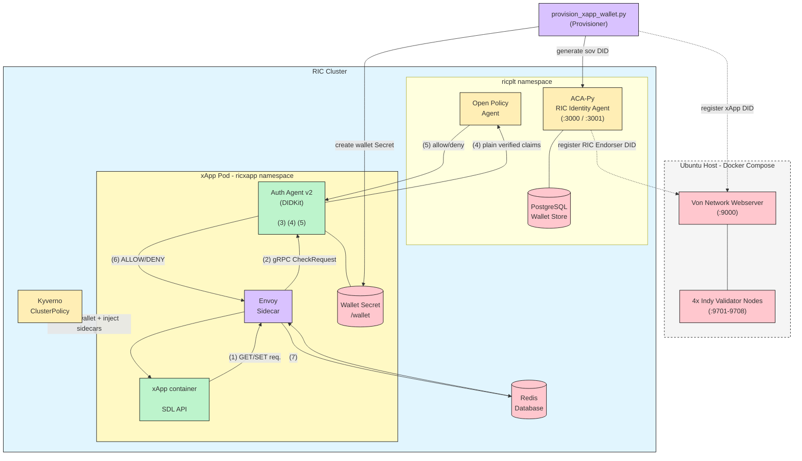

# DID/VC based approach as Zero Trust Architecture for O-RAN Shared Data Layer (SDL)

## Overview
This approach replaces the centralized Identity Provider (Keycloak/JWT) trust model with a **decentralized identity** model based on W3C Decentralized Identifiers (DIDs) and Verifiable Credentials (VCs), anchored on a Hyperledger Indy ledger. Instead of an xApp fetching a bearer token from a central IdP on every cycle, the RIC issues each xApp a cryptographically signed Verifiable Credential once, at onboarding time. At runtime the xApp's sidecar proves possession of that credential by constructing a signed Verifiable Presentation (VP), without any network round-trip to an identity server.

The RIC plays the role of **VC Issuer**, the xApp is the **VC Holder**, and the Auth Agent sidecar acts as the **VC Verifier**. Trust is rooted in the Indy ledger (which anchors the RIC's DID) and in Ed25519 signatures (which anchor the credential and presentation), not in a live session with an identity server.

xApp pod contains 3 containers.
1. xApp container
   - Hosts the core xApp application logic.
2. Envoy sidecar
   - Acts as a secure proxy for inbound and outbound traffic.
   - Intercepts the raw SDL (Redis) TCP connection and issues an `ext_authz` gRPC check before allowing traffic through.
3. Auth Agent Container (DID/VC, v2)
   - Loads the xApp's DID/VC wallet from a mounted Kubernetes Secret.
   - Verifies the VC's signature and issuer at startup, and proves DID ownership via a VP on every `Check` request.
   - Extracts plain verified claims from the credential and forwards them to OPA for the final policy decision.



# Phase 1: Von Network (Hyperledger Indy Ledger) Setup

The Indy ledger is the root of trust for every DID in this architecture. We attempted to run Von Network as native Kubernetes Deployments (`von-network-k8s.yaml`) first, but each node's genesis file is generated dynamically by the container's startup script and the 4 validator pods need to discover each other's genesis transactions before the pool can reach consensus. Kubernetes' pod scheduling and DNS propagation timing caused the genesis generation to race between nodes, so the pool never stabilized. Von Network was moved outside the cluster and run as a **Docker Compose stack on the Ubuntu host** instead — this is the version actually used for the working testbed.

```bash
# Clone Von Network on the Ubuntu host (outside the K8s cluster)
git clone https://github.com/bcgov/von-network.git
cd von-network

# Build the images
./manage build

# Start a 4-node local Indy pool + web UI, bound to the host's LAN IP
./manage start --logs
```

Verify the ledger is up:
```bash
curl http://<HOST_IP>:9000/status
```

The Von Network webserver exposes a genesis file and a self-serve DID registration endpoint that both ACA-Py and the provisioner script use:
```bash
# Fetch the genesis transactions (used by ACA-Py and copied into every xApp wallet)
curl http://<HOST_IP>:9000/genesis -o ric-genesis.txn

# Self-serve DID registration endpoint used to anchor new DIDs on the ledger
curl -X POST http://<HOST_IP>:9000/register \
  -H "Content-Type: application/json" \
  -d '{"did": "<did>", "verkey": "<verkey>"}'
```

Copy `ric-genesis.txn` to a path reachable by the RIC cluster tooling (referenced later as `GENESIS_PATH` and mounted into ACA-Py as a ConfigMap):
```bash
cp ric-genesis.txn ~/did-vc-setup/ric-genesis.txn
```

The abandoned `von-network-k8s.yaml` manifest is kept for reference — it deploys `von-node1..4` and `von-webserver` as Deployments in a `ricidentity` namespace, but is **not** part of the working deployment:
```bash
apiVersion: apps/v1
kind: Deployment
metadata:
  name: von-node1
  namespace: ricidentity
spec:
  replicas: 1
  selector:
    matchLabels:
      app: von-node1
  template:
    metadata:
      labels:
        app: von-node1
    spec:
      containers:
      - name: indy-node
        image: ghcr.io/bcgov/von-network-base:latest
        env:
        - name: NODE_NUM
          value: "1"
        - name: NODE_COUNT
          value: "4"
        - name: LEDGER_SEED
          value: "000000000000000000000000Steward1"
        - name: IPS
          value: "von-node1,von-node2,von-node3,von-node4"
        - name: REGISTER_NEW_DIDS
          value: "true"
        ports:
        - containerPort: 9701
        - containerPort: 9702
        volumeMounts:
        - name: node-data
          mountPath: /home/indy/.indy_client
      volumes:
      - name: node-data
        emptyDir: {}
# ... von-node2, von-node3, von-node4 and von-webserver follow the same pattern,
# each with a distinct NODE_NUM / LEDGER_SEED / port pair.
```

# Phase 2: ACA-Py Identity Agent Deployment (ricplt namespace)

[Aries Cloud Agent Python (ACA-Py)](https://github.com/hyperledger/aries-cloudagent-python) is deployed inside the `ricplt` namespace as the RIC's identity agent. It talks to the Von Network ledger over the genesis file, and persists its wallet in PostgreSQL so DIDs survive pod restarts.

Create the genesis ConfigMap from the file fetched in Phase 1:
```bash
kubectl create configmap indy-genesis \
  --from-file=genesis.txn=ric-genesis.txn \
  -n ricplt
```

Create `acapy-postgres.yaml`:
```bash
apiVersion: v1
kind: Secret
metadata:
  name: acapy-postgres-secret
  namespace: ricplt
type: Opaque
stringData:
  POSTGRES_DB: acapy
  POSTGRES_USER: acapy
  POSTGRES_PASSWORD: acapy-ric-password-2024
---
apiVersion: apps/v1
kind: Deployment
metadata:
  name: acapy-postgres
  namespace: ricplt
spec:
  replicas: 1
  selector:
    matchLabels:
      app: acapy-postgres
  template:
    metadata:
      labels:
        app: acapy-postgres
    spec:
      containers:
      - name: postgres
        image: postgres:14
        envFrom:
        - secretRef:
            name: acapy-postgres-secret
        ports:
        - containerPort: 5432
        volumeMounts:
        - name: postgres-data
          mountPath: /var/lib/postgresql/data
      volumes:
      - name: postgres-data
        emptyDir: {}
---
apiVersion: v1
kind: Service
metadata:
  name: acapy-postgres
  namespace: ricplt
spec:
  selector:
    app: acapy-postgres
  ports:
  - port: 5432
    targetPort: 5432
```

Create `acapy-agent.yaml`:
```bash
apiVersion: apps/v1
kind: Deployment
metadata:
  name: acapy-ric-agent
  namespace: ricplt
spec:
  replicas: 1
  selector:
    matchLabels:
      app: acapy-ric-agent
  template:
    metadata:
      labels:
        app: acapy-ric-agent
    spec:
      containers:
      - name: acapy
        image: ghcr.io/hyperledger/aries-cloudagent-python:py3.9-0.10.4
        command:
        - aca-py
        - start
        - --inbound-transport
        - http
        - "0.0.0.0"
        - "3000"
        - --outbound-transport
        - http
        - --endpoint
        - "http://acapy-ric-agent.ricplt:3000"
        - --admin
        - "0.0.0.0"
        - "3001"
        - --admin-insecure-mode
        - --genesis-file
        - /genesis/genesis.txn
        - --seed
        - "RIC00000000000000000Endorser001!"
        - --wallet-type
        - askar
        - --wallet-name
        - ric-wallet
        - --wallet-key
        - ric-wallet-key-secure-2024
        - --wallet-storage-type
        - postgres_storage
        - --wallet-storage-config
        - '{"url":"acapy-postgres:5432","db_name":"acapy"}'
        - --wallet-storage-creds
        - '{"account":"acapy","password":"acapy-ric-password-2024"}'
        - --auto-provision
        - --log-level
        - info
        - --label
        - "RIC-Identity-Agent"
        ports:
        - containerPort: 3000
          name: agent
        - containerPort: 3001
          name: admin
        volumeMounts:
        - name: genesis
          mountPath: /genesis
        readinessProbe:
          httpGet:
            path: /status/ready
            port: 3001
          initialDelaySeconds: 20
          periodSeconds: 10
        livenessProbe:
          httpGet:
            path: /status/live
            port: 3001
          initialDelaySeconds: 30
          periodSeconds: 30
      volumes:
      - name: genesis
        configMap:
          name: indy-genesis
---
apiVersion: v1
kind: Service
metadata:
  name: acapy-ric-agent
  namespace: ricplt
spec:
  selector:
    app: acapy-ric-agent
  ports:
  - name: agent
    port: 3000
    targetPort: 3000
  - name: admin
    port: 3001
    targetPort: 3001
```

Apply both manifests and wait for ACA-Py to report ready:
```bash
kubectl apply -f acapy-postgres.yaml -f acapy-agent.yaml
kubectl rollout status deployment/acapy-ric-agent -n ricplt
```

Port-forward the Admin API for provisioning work done from the host:
```bash
sudo kubectl port-forward -n ricplt svc/acapy-ric-agent 3001:3001
curl -s http://localhost:3001/status | python3 -m json.tool
```

Note: `--seed "RIC00000000000000000Endorser001!"` deterministically derives ACA-Py's own Indy DID and verkey. That DID is **not** present on a fresh ledger by default, so it must be self-registered the same way xApp DIDs are (Phase 7) before it can write schema/cred-def transactions as an Endorser.

# Phase 3: RIC Endorser DID, Schema, and Credential Definition

Once ACA-Py is running, it needs its own DID registered on the ledger with Endorser rights before it can publish a credential schema.

Fetch ACA-Py's public DID and register it via Von Network's self-serve endpoint:
```bash
# Get the DID/verkey ACA-Py derived from its seed
curl -s http://localhost:3001/wallet/did/public | python3 -m json.tool

# Register it on the ledger (grants NYM/Endorser role)
curl -X POST http://<HOST_IP>:9000/register \
  -H "Content-Type: application/json" \
  -d '{"did": "KewdxLKBU9Fgu5aac8PH4R", "verkey": "<verkey_from_above>", "role": "ENDORSER"}'
```

This is the **RIC Endorser DID**: `KewdxLKBU9Fgu5aac8PH4R`, anchored on the Indy ledger and used as the trust root the Auth Agent checks against (`TRUSTED_RIC_DID` / `RIC_DID`).

Publish the SDL access credential schema through the ACA-Py Admin API:
```bash
curl -X POST http://localhost:3001/schemas \
  -H "Content-Type: application/json" \
  -d '{
    "schema_name": "sdl-access-credential",
    "schema_version": "1.0",
    "attributes": [
      "xapp_name", "xapp_version", "allowed_namespaces", "permissions",
      "ric_realm", "ric_issuer_sov_did", "sov_did", "issued_at", "valid_until"
    ]
  }'
```
Expected `schema_id`: `KewdxLKBU9Fgu5aac8PH4R:2:sdl-access-credential:1.0`

Publish the credential definition (binds the schema to the RIC's signing key):
```bash
curl -X POST http://localhost:3001/credential-definitions \
  -H "Content-Type: application/json" \
  -d '{
    "schema_id": "KewdxLKBU9Fgu5aac8PH4R:2:sdl-access-credential:1.0",
    "tag": "sdl-access-v1",
    "support_revocation": false
  }'
```
Expected `credential_definition_id`: `KewdxLKBU9Fgu5aac8PH4R:3:CL:8:sdl-access-v1`

Store these ledger-anchored identifiers as a ConfigMap that the provisioner and Auth Agent both read from:
```bash
kubectl create configmap ric-vc-config -n ricplt \
  --from-literal=RIC_DID=KewdxLKBU9Fgu5aac8PH4R \
  --from-literal=LEDGER_URL=http://<HOST_IP>:9000 \
  --from-literal=SCHEMA_ID=KewdxLKBU9Fgu5aac8PH4R:2:sdl-access-credential:1.0 \
  --from-literal=CRED_DEF_ID=KewdxLKBU9Fgu5aac8PH4R:3:CL:8:sdl-access-v1
```

# Phase 4: RIC Issuer Identity (DIDKit Signing Key)

ACA-Py 0.10.4 with an `askar` wallet does not expose the `/vc/credentials/issue` W3C endpoint, so W3C VC signing is done separately with **DIDKit** using a `did:key` issuer identity that is bound to the RIC's Indy sov DID. This identity is generated once and persisted as a Kubernetes Secret so every xApp credential is signed by the same RIC issuer key across provisioning runs.

Create `create_ric_issuer.py`:
```python
import json, os, asyncio, inspect
from pathlib import Path
import didkit

ISSUER_PATH = Path("/home/pasindu/did-vc-setup/ric-issuer.json")
RIC_SOV_DID = os.environ.get("RIC_SOV_DID")

if not RIC_SOV_DID:
    raise Exception("RIC_SOV_DID environment variable is missing")

def didkit_call(fn, *args):
    async def runner():
        result = fn(*args)
        if inspect.isawaitable(result):
            result = await result
        return result
    return asyncio.run(runner())

if ISSUER_PATH.exists():
    print(f"[!] Issuer file already exists: {ISSUER_PATH}")
    print("[!] Not overwriting it.")
    with open(ISSUER_PATH, "r") as f:
        existing = json.load(f)
    safe = dict(existing)
    safe["issuer_jwk"] = "[PRIVATE KEY HIDDEN]"
    print(json.dumps(safe, indent=2))
    exit(0)

issuer_jwk = didkit_call(didkit.generate_ed25519_key)
issuer_did = didkit_call(didkit.key_to_did, "key", issuer_jwk)

fragment = issuer_did.split(":")[-1]
issuer_vm = f"{issuer_did}#{fragment}"

issuer = {
    "label": "RIC Identity Authority",
    "ric_sov_did": RIC_SOV_DID,
    "issuer_did": issuer_did,
    "issuer_vm": issuer_vm,
    "issuer_jwk": issuer_jwk
}

ISSUER_PATH.write_text(json.dumps(issuer, indent=2))
os.chmod(ISSUER_PATH, 0o600)

safe = dict(issuer)
safe["issuer_jwk"] = "[PRIVATE KEY HIDDEN]"

print("[+] Persistent RIC issuer identity created")
print(json.dumps(safe, indent=2))
```

Run it once, binding the DIDKit issuer key to the RIC Endorser sov DID from Phase 3:
```bash
RIC_SOV_DID=KewdxLKBU9Fgu5aac8PH4R python3 create_ric_issuer.py
```

This produces `ric-issuer.json` (kept `0o600`, private key redacted from any log output):
```json
{
  "label": "RIC Identity Authority",
  "ric_sov_did": "KewdxLKBU9Fgu5aac8PH4R",
  "issuer_did": "did:key:z6Mkm8GwKYg4W7zFzos9eK8RQNvgufA8ymvHfjdKW97irKZt",
  "issuer_vm": "did:key:z6Mkm8GwKYg4W7zFzos9eK8RQNvgufA8ymvHfjdKW97irKZt#z6Mkm8GwKYg4W7zFzos9eK8RQNvgufA8ymvHfjdKW97irKZt",
  "issuer_jwk": "{\"kty\":\"OKP\",\"crv\":\"Ed25519\",\"x\":\"YyTIFO5hrC7dsBpLnPByNfwe0Vo5xnak5W6aV742w3M\",\"d\":\"EHodX8cKMlzYZHRaf_DzzVOg-z4X3t90llwa9sZwYNE\"}"
}
```

In this testbed the issuer keypair is regenerated fresh whenever `ric-issuer.json` is deleted — in production this key would be treated as the RIC's permanent signing identity and rotated deliberately, not regenerated per provisioning run.

Load it into the cluster as a Secret so the provisioner can read it without touching the filesystem of a running pod:
```bash
kubectl create secret generic ric-issuer-secret -n ricplt \
  --from-file=ric-issuer.json=ric-issuer.json
```

# Phase 5: Auth Agent v2 (DIDKit-enabled Envoy ext_authz Sidecar)

Auth Agent v2 extends the JWT-based Auth Agent from the Localized PEP approach (see `Main-Implementation.md`) — it keeps the same `ext_authz` gRPC contract with Envoy, but replaces Keycloak token verification with DID/VC verification.

Create `Dockerfile` (built on top of the existing `pasindujanith/auth-agent:v1` base image, adding DIDKit):
```bash
FROM pasindujanith/auth-agent:v1

RUN pip install --no-cache-dir didkit

COPY agent.py /app/agent.py

RUN python3 -m py_compile /app/agent.py
RUN python3 -c "import didkit; print('DIDKit installed OK')"

CMD ["python3", "/app/agent.py"]
```

Create `agent.py`:
```python
import os
import json
import time
import grpc
import asyncio
import inspect
from datetime import datetime
from concurrent import futures

import envoy.service.auth.v3.external_auth_pb2 as auth_pb2
import envoy.service.auth.v3.external_auth_pb2_grpc as auth_pb2_grpc
import envoy.service.auth.v3.attribute_context_pb2 as attribute_context_pb2
from envoy.type.v3 import http_status_pb2 as http_status_pb2

try:
    from google.rpc import status_pb2 as google_status_pb2
    from google.rpc import code_pb2 as google_code_pb2
except Exception:
    google_status_pb2 = None
    google_code_pb2 = None


# ── Config ────────────────────────────────────────────────────────────────────
WALLET_PATH = os.environ.get("WALLET_PATH", "/wallet")
OPA_GRPC_URL = os.environ.get("OPA_GRPC_URL", "opa-service.ricplt.svc.cluster.local:9191")
XAPP_NAME = os.environ.get("XAPP_NAME", "unknown-xapp")

# Should come from ric-vc-config ConfigMap
TRUSTED_RIC_DID = os.environ.get("RIC_DID", "KewdxLKBU9Fgu5aac8PH4R")


# ── DIDKit wrapper for DIDKit 0.3.3 ───────────────────────────────────────────
def didkit_call(fn, *args):
    async def runner():
        result = fn(*args)
        if inspect.isawaitable(result):
            result = await result
        return result

    return asyncio.run(runner())


# ── Envoy deny response ───────────────────────────────────────────────────────
def deny_response(reason="Access denied"):
    print(f"[AGENT] DENY: {reason}")

    if google_status_pb2 is not None:
        return auth_pb2.CheckResponse(
            status=google_status_pb2.Status(
                code=google_code_pb2.PERMISSION_DENIED,
                message=reason,
            ),
            denied_response=auth_pb2.DeniedHttpResponse(
                status=http_status_pb2.HttpStatus(
                    code=http_status_pb2.StatusCode.Value("Forbidden")
                ),
                body=reason,
            ),
        )

    # Fallback for older generated protobuf packages
    return auth_pb2.CheckResponse(
        status=http_status_pb2.HttpStatus(
            code=http_status_pb2.StatusCode.Value("Forbidden")
        )
    )


# ── Helper functions ──────────────────────────────────────────────────────────
def read_json_file(path):
    with open(path, "r") as f:
        return json.load(f)


def did_key_vm(did):
    """
    For did:key:z6Mkabc..., verification method is:
    did:key:z6Mkabc...#z6Mkabc...
    """
    fragment = did.split(":")[-1]
    return f"{did}#{fragment}"


def action_to_permission(action):
    """
    Maps SDL/Redis style actions to VC permissions.
    Adjust this later if your OPA policy uses different action names.
    """
    if not action:
        return None

    action = action.upper()

    if action in ["GET", "READ", "MGET", "EXISTS"]:
        return "read"

    if action in ["SET", "WRITE", "POST", "PUT", "DELETE", "DEL"]:
        return "write"

    return action.lower()


def parse_json_list(value):
    if isinstance(value, list):
        return value
    if isinstance(value, str):
        try:
            return json.loads(value)
        except Exception:
            return [v.strip() for v in value.split(",") if v.strip()]
    return []


# ── Load wallet at startup ────────────────────────────────────────────────────
def load_wallet():
    did_path = os.path.join(WALLET_PATH, "did.json")
    vc_path = os.path.join(WALLET_PATH, "vc.json")
    issuer_path = os.path.join(WALLET_PATH, "issuer.json")

    if not os.path.exists(did_path):
        print(f"[AGENT] ERROR: Missing {did_path}")
        return None, None, None, None

    if not os.path.exists(vc_path):
        print(f"[AGENT] ERROR: Missing {vc_path}")
        return None, None, None, None

    if not os.path.exists(issuer_path):
        print(f"[AGENT] ERROR: Missing {issuer_path}")
        return None, None, None, None

    did_data = read_json_file(did_path)
    vc_data = read_json_file(vc_path)
    issuer_data = read_json_file(issuer_path)

    # xApp private key must be in did.json
    xapp_jwk = did_data.get("jwk")
    if not xapp_jwk:
        print("[AGENT] ERROR: xApp private JWK missing in did.json")
        return None, None, None, None

    # issuer.json must contain only public issuer data
    if "jwk" in issuer_data or "issuer_jwk" in issuer_data:
        print("[AGENT] ERROR: issuer.json contains issuer private key. Unsafe wallet.")
        return None, None, None, None

    print("[AGENT] Wallet loaded")
    print(f"[AGENT] xApp DID       : {did_data.get('did')}")
    print(f"[AGENT] xApp Sov DID   : {did_data.get('sov_did')}")
    print(f"[AGENT] RIC Issuer DID : {issuer_data.get('issuer_did')}")
    print(f"[AGENT] RIC Sov DID    : {issuer_data.get('ric_sov_did')}")
    print(f"[AGENT] Trusted RIC DID: {TRUSTED_RIC_DID}")

    return did_data, vc_data, issuer_data, xapp_jwk


# ── Verify VC at startup ──────────────────────────────────────────────────────
def verify_vc_at_startup():
    if DID_DATA is None or VC_DATA is None or ISSUER_DATA is None:
        return False

    try:
        import didkit

        vc_issuer = VC_DATA.get("issuer")
        trusted_issuer = ISSUER_DATA.get("issuer_did")

        if vc_issuer != trusted_issuer:
            print("[AGENT] ERROR: VC issuer mismatch")
            print(f"[AGENT] VC issuer      : {vc_issuer}")
            print(f"[AGENT] Trusted issuer : {trusted_issuer}")
            return False

        issuer_ric_did = ISSUER_DATA.get("ric_sov_did")
        if issuer_ric_did != TRUSTED_RIC_DID:
            print("[AGENT] ERROR: issuer.json RIC DID mismatch")
            print(f"[AGENT] issuer.json RIC DID : {issuer_ric_did}")
            print(f"[AGENT] trusted RIC DID     : {TRUSTED_RIC_DID}")
            return False

        subj = VC_DATA.get("credentialSubject", {})
        vc_ric_did = subj.get("ric_issuer_sov_did")

        if vc_ric_did != TRUSTED_RIC_DID:
            print("[AGENT] ERROR: VC subject RIC DID mismatch")
            print(f"[AGENT] VC RIC DID      : {vc_ric_did}")
            print(f"[AGENT] Trusted RIC DID : {TRUSTED_RIC_DID}")
            return False

        vc_xapp_name = subj.get("xapp_name")
        if XAPP_NAME != "unknown-xapp" and vc_xapp_name != XAPP_NAME:
            print("[AGENT] ERROR: VC xApp name mismatch")
            print(f"[AGENT] VC xApp name  : {vc_xapp_name}")
            print(f"[AGENT] Env XAPP_NAME : {XAPP_NAME}")
            return False

        verify_raw = didkit_call(
            didkit.verify_credential,
            json.dumps(VC_DATA),
            "{}",
        )
        verify_result = json.loads(verify_raw)

        if verify_result.get("errors"):
            print(f"[AGENT] ERROR: VC cryptographic verification failed: {verify_result['errors']}")
            return False

        print("[AGENT] VC issuer, RIC DID, xApp name, and signature verified")
        return True

    except Exception as e:
        print(f"[AGENT] VC startup verification error: {e}")
        return False


# ── Extract claims from VC ────────────────────────────────────────────────────
def extract_claims():
    try:
        subj = VC_DATA.get("credentialSubject", {})

        valid_until = subj.get("valid_until")
        if valid_until:
            now = datetime.utcnow().strftime("%Y-%m-%dT%H:%M:%SZ")
            if now > valid_until:
                print(f"[AGENT] VC expired at {valid_until}")
                return None

        allowed_namespaces = parse_json_list(subj.get("allowed_namespaces", []))
        permissions = parse_json_list(subj.get("permissions", []))

        return {
            "xapp_name": subj.get("xapp_name", XAPP_NAME),
            "xapp_did": subj.get("id"),
            "xapp_sov_did": subj.get("sov_did"),
            "allowed_namespaces": allowed_namespaces,
            "permissions": permissions,
            "ric_issuer_sov_did": subj.get("ric_issuer_sov_did"),
            "schema_id": subj.get("schema_id"),
            "cred_def_id": subj.get("cred_def_id"),
            "valid_until": valid_until,
        }

    except Exception as e:
        print(f"[AGENT] Claim extraction error: {e}")
        return None


# ── Verify xApp DID ownership using VP ────────────────────────────────────────
def verify_did_ownership(nonce):
    try:
        import didkit

        xapp_did = DID_DATA.get("did")
        xapp_jwk = XAPP_JWK

        if not xapp_did or not xapp_jwk:
            print("[AGENT] Missing xApp DID or private JWK")
            return False

        xapp_vm = did_key_vm(xapp_did)

        vp = {
            "@context": [
                "https://www.w3.org/2018/credentials/v1",
                "https://w3id.org/security/suites/ed25519-2020/v1",
            ],
            "type": ["VerifiablePresentation"],
            "verifiableCredential": [VC_DATA],
        }

        proof_options = {
            "type": "Ed25519Signature2020",
            "verificationMethod": xapp_vm,
            "proofPurpose": "authentication",
            "challenge": nonce,
            "domain": "ric.internal",
        }

        signed_vp = didkit_call(
            didkit.issue_presentation,
            json.dumps(vp),
            json.dumps(proof_options),
            xapp_jwk,
        )

        verify_raw = didkit_call(
            didkit.verify_presentation,
            signed_vp,
            json.dumps({
                "challenge": nonce,
                "domain": "ric.internal",
            }),
        )

        verify_result = json.loads(verify_raw)

        if verify_result.get("errors"):
            print(f"[AGENT] VP verification failed: {verify_result['errors']}")
            return False

        print(f"[AGENT] DID ownership verified: {xapp_did}")
        return True

    except Exception as e:
        print(f"[AGENT] VP verification error: {e}")
        return False


# ── Optional local VC permission check ────────────────────────────────────────
def local_vc_permission_check(claims, request_headers):
    """
    This does a simple local pre-check before OPA.
    OPA remains the final policy decision point.
    """
    action = request_headers.get("x-sdl-action", "SET")
    required_permission = action_to_permission(action)

    if required_permission and required_permission not in claims["permissions"]:
        print(f"[AGENT] VC permission check failed. Required={required_permission}, VC={claims['permissions']}")
        return False

    req_namespace = request_headers.get("x-sdl-namespace")

    if req_namespace:
        if req_namespace not in claims["allowed_namespaces"]:
            print(f"[AGENT] VC namespace check failed. Requested={req_namespace}, VC={claims['allowed_namespaces']}")
            return False

    return True


# ── Query OPA via gRPC ────────────────────────────────────────────────────────
def query_opa_grpc(claims, request_headers):
    try:
        headers = {
            "x-app-id": claims["xapp_name"],
            "x-sdl-action": request_headers.get("x-sdl-action", "SET"),
            "x-vc-verified": "true",
            "x-ric-issuer-did": ISSUER_DATA.get("issuer_did", ""),
            "x-ric-sov-did": claims.get("ric_issuer_sov_did", ""),
            "x-xapp-did": claims.get("xapp_did", ""),
            "x-xapp-sov-did": claims.get("xapp_sov_did", ""),
            "x-allowed-namespaces": ",".join(claims.get("allowed_namespaces", [])),
            "x-permissions": ",".join(claims.get("permissions", [])),
        }

        # Preserve useful original request headers if present
        for key in [":method", ":path", "x-sdl-namespace", "x-sdl-action"]:
            if key in request_headers:
                headers[key] = request_headers[key]

        with grpc.insecure_channel(OPA_GRPC_URL) as channel:
            stub = auth_pb2_grpc.AuthorizationStub(channel)
            opa_request = auth_pb2.CheckRequest(
                attributes=attribute_context_pb2.AttributeContext(
                    request=attribute_context_pb2.AttributeContext.Request(
                        http=attribute_context_pb2.AttributeContext.HttpRequest(
                            headers=headers
                        )
                    )
                )
            )

            opa_response = stub.Check(opa_request)
            print("[AGENT] OPA gRPC response received")
            return opa_response

    except Exception as e:
        print(f"[AGENT] OPA gRPC error: {e}")
        return deny_response("OPA error")


# ── Startup ───────────────────────────────────────────────────────────────────
print(f"[AGENT] Starting Auth Agent for {XAPP_NAME}")

DID_DATA, VC_DATA, ISSUER_DATA, XAPP_JWK = load_wallet()

VC_STARTUP_OK = False
if DID_DATA is not None and VC_DATA is not None and ISSUER_DATA is not None:
    VC_STARTUP_OK = verify_vc_at_startup()

if VC_STARTUP_OK:
    print("[AGENT] DID/VC startup verification passed")
else:
    print("[AGENT] DID/VC startup verification failed. All requests will be denied.")


# ── gRPC Check handler ────────────────────────────────────────────────────────
class AuthzServicer(auth_pb2_grpc.AuthorizationServicer):

    def Check(self, request, context):
        timestamp = datetime.utcnow().strftime("%Y-%m-%d %H:%M:%S")
        print(f"\n[AGENT] [{timestamp}] CheckRequest for {XAPP_NAME}")

        if not VC_STARTUP_OK:
            return deny_response("VC startup verification failed")

        request_headers = dict(request.attributes.request.http.headers)

        # Step 1: Extract and validate VC claims
        claims = extract_claims()
        if claims is None:
            return deny_response("Invalid or expired VC")

        print(f"[AGENT] VC claims: namespaces={claims['allowed_namespaces']} permissions={claims['permissions']}")

        # Step 2: Prove xApp owns DID key using VP
        nonce = f"req-{XAPP_NAME}-{int(time.time())}"
        if not verify_did_ownership(nonce):
            return deny_response("DID ownership verification failed")

        # Step 3: Simple local VC permission check
        if not local_vc_permission_check(claims, request_headers):
            return deny_response("VC permission check failed")

        # Step 4: OPA final decision
        print(f"[AGENT] DID/VC verified. Querying OPA for {claims['xapp_name']}...")
        return query_opa_grpc(claims, request_headers)


if __name__ == "__main__":
    server = grpc.server(futures.ThreadPoolExecutor(max_workers=5))
    auth_pb2_grpc.add_AuthorizationServicer_to_server(AuthzServicer(), server)
    server.add_insecure_port("[::]:50051")

    print("[AGENT] Auth Agent DID/VC mode started on port 50051")
    server.start()

    try:
        server.wait_for_termination()
    except KeyboardInterrupt:
        print("\n[AGENT] Shutdown requested by user")
        server.stop(0)
        print("[AGENT] Auth Agent stopped cleanly")
```

Build and push the image:
```bash
cd auth-agent-v2
sudo docker build -t ashank2001/auth-agent:v2 .
sudo docker push ashank2001/auth-agent:v2
```


# Phase 6: Kyverno Wallet Injection

Kyverno's mutation rule from the Localized PEP approach (`Main-Implementation.md`) is extended to also mount each xApp's `xapp-wallet-<name>` Secret into the Auth Agent container at `/wallet`, and to inject the trusted `RIC_DID` from the `ric-vc-config` ConfigMap so the agent knows what issuer DID to trust without a code change.

Create `kyverno-v2.yaml`:
```bash
apiVersion: kyverno.io/v1
kind: ClusterPolicy
metadata:
  name: touchless-xapp-security
spec:
  admission: true
  background: true
  validationFailureAction: Audit
  rules:
  - name: generate-tls-cert
    match:
      any:
      - resources:
          kinds:
          - Deployment
          namespaces:
          - ricxapp
    generate:
      apiVersion: cert-manager.io/v1
      kind: Certificate
      name: "{{request.object.metadata.name}}-cert"
      namespace: ricxapp
      synchronize: true
      data:
        spec:
          secretName: "{{request.object.metadata.name}}-certs"
          commonName: "{{request.object.metadata.name}}"
          issuerRef:
            name: smo-root-ca
            kind: ClusterIssuer

  - name: inject-sidecars
    match:
      any:
      - resources:
          kinds:
          - Pod
          namespaces:
          - ricxapp
    mutate:
      patchStrategicMerge:
        spec:
          containers:
          - (name): "?*"
            env:
            - name: DBAAS_SERVICE_HOST
              value: "127.0.0.1"
            - name: DBAAS_SERVICE_PORT
              value: "6379"

          - name: envoy-proxy
            image: envoyproxy/envoy:v1.28.0
            volumeMounts:
            - name: sidecar-configs
              mountPath: /etc/envoy/envoy.yaml
              subPath: envoy.yaml

          - name: auth-agent
            image: ashank2001/auth-agent:v2
            imagePullPolicy: Always
            env:
            - name: XAPP_NAME
              valueFrom:
                fieldRef:
                  fieldPath: metadata.labels['app']
            - name: WALLET_PATH
              value: /wallet
            - name: RIC_DID
              valueFrom:
                configMapKeyRef:
                  name: ric-vc-config
                  key: RIC_DID
            volumeMounts:
            - name: sidecar-configs
              mountPath: /app/agent.py
              subPath: agent.py
            - name: xapp-tls-volume
              mountPath: /etc/xapp-certs
              readOnly: true
            - name: xapp-wallet
              mountPath: /wallet
              readOnly: true

          volumes:
          - name: sidecar-configs
            configMap:
              name: zerotrust-sidecar-configs
          - name: xapp-tls-volume
            secret:
              secretName: "{{request.object.metadata.labels.app}}-certs"
          - name: xapp-wallet
            secret:
              secretName: "xapp-wallet-{{request.object.metadata.labels.app}}"
```

Apply it to the cluster:
```bash
sudo kubectl apply -f kyverno-v2.yaml
```

Note: Kyverno's `generate` rule for Certificates runs unconditionally on every `Deployment` in `ricxapp`, but the `xapp-wallet-<name>` Secret referenced by the `inject-sidecars` rule must already exist (it is created by the provisioner in Phase 8) **before** the xApp pod is scheduled — otherwise the pod stays in `ContainerCreating` waiting on a missing Secret volume.

# Phase 7: xApp DID/VC Wallet Provisioning

`provision_xapp_wallet.py` is the operator-run script that onboards a single xApp into the DID/VC trust framework. It performs, in order:

1. Generates an Indy `sov` DID/verkey pair for the xApp via ACA-Py's wallet API.
2. Registers that sov DID on the Indy ledger through Von Network's `/register` endpoint.
3. Generates a **separate** `did:key` signing keypair for the xApp via DIDKit (used only for VP signing, not ledger anchored).
4. Builds and signs a W3C Verifiable Credential (`SDLAccessCredential`) with the RIC issuer's DIDKit key from Phase 4, embedding the xApp's allowed namespaces and permissions as `credentialSubject` claims.
5. Verifies the signed VC immediately after signing (fail fast if signing produced something invalid).
6. Builds a throwaway test VP and verifies it end-to-end, to catch verification-method mismatches before they show up as a runtime outage in the Auth Agent.
7. Reads the ledger genesis file.
8. Creates (replacing any existing) `xapp-wallet-<xapp_name>` Secret in the `ricxapp` namespace containing `did.json`, `vc.json`, `issuer.json`, and `genesis.txn`.

Create `provision_xapp_wallet.py`:
```python
"""
Provisions DID/VC wallet for an xApp.
Usage: python3 provision_xapp_wallet.py <xapp_name> <namespaces_csv> <permissions_csv>
Example: python3 provision_xapp_wallet.py ricxapp-sdl-xapp e2-metrics,kpi-store read,write
"""

import sys, json, requests, os, asyncio, inspect, base64
from datetime import datetime, timedelta
from kubernetes import client as k8s_client, config as k8s_config

ACAPY_ADMIN  = "http://localhost:3001"
CONFIG_NAMESPACE = "ricplt"
CONFIGMAP_NAME = "ric-vc-config"
ISSUER_SECRET_NAME = "ric-issuer-secret"
XAPP_NAMESPACE = "ricxapp"
GENESIS_PATH = "/home/pasindu/did-vc-setup/ric-genesis.txn"


# Run DIDKit calls in a thread pool to avoid event loop conflicts
# DIDKit 0.3.3 uses an internal Rust/Tokio runtime that conflicts
# with Python's asyncio event loop context

def didkit_call(fn, *args):
    """
    DIDKit 0.3.3 sometimes returns asyncio Future objects.
    This wrapper executes the call and awaits the Future before returning.
    """
    async def runner():
        result = fn(*args)
        if inspect.isawaitable(result):
            result = await result
        return result

    return asyncio.run(runner())

def load_kubeconfig():
    kubeconfig_paths = [
        os.path.expanduser("~/.kube/config"),
        "/home/pasindu/.kube/config",
        "/root/.kube/config",
        "/etc/kubernetes/admin.conf",
    ]

    for kpath in kubeconfig_paths:
        if os.path.exists(kpath):
            try:
                k8s_config.load_kube_config(config_file=kpath)
                print(f"[+] Loaded kubeconfig from {kpath}")
                return
            except Exception as e:
                print(f"[!] Could not load {kpath}: {e}")

    raise Exception("Cannot find valid kubeconfig")


def load_ric_vc_config():
    v1 = k8s_client.CoreV1Api()
    cm = v1.read_namespaced_config_map(CONFIGMAP_NAME, CONFIG_NAMESPACE)

    data = cm.data or {}

    required = ["RIC_DID", "LEDGER_URL", "SCHEMA_ID", "CRED_DEF_ID"]
    missing = [k for k in required if k not in data]

    if missing:
        raise Exception(f"Missing values in ConfigMap {CONFIGMAP_NAME}: {missing}")

    return {
        "ric_sov_did": data["RIC_DID"],
        "ledger_url": data["LEDGER_URL"],
        "schema_id": data["SCHEMA_ID"],
        "cred_def_id": data["CRED_DEF_ID"],
    }


def load_ric_issuer_secret():
    v1 = k8s_client.CoreV1Api()
    sec = v1.read_namespaced_secret(ISSUER_SECRET_NAME, CONFIG_NAMESPACE)

    encoded = sec.data.get("ric-issuer.json")
    if not encoded:
        raise Exception("ric-issuer.json not found inside ric-issuer-secret")

    issuer_json = base64.b64decode(encoded).decode("utf-8")
    issuer = json.loads(issuer_json)

    required = ["ric_sov_did", "issuer_did", "issuer_vm", "issuer_jwk"]
    missing = [k for k in required if k not in issuer]

    if missing:
        raise Exception(f"Missing values in ric-issuer.json: {missing}")

    return issuer

def provision(xapp_name, allowed_namespaces, permissions):
    load_kubeconfig()

    ric_config = load_ric_vc_config()
    ric_issuer = load_ric_issuer_secret()

    ric_sov_did = ric_config["ric_sov_did"]
    ledger_url = ric_config["ledger_url"]
    schema_id = ric_config["schema_id"]
    cred_def_id = ric_config["cred_def_id"]

    issuer_jwk = ric_issuer["issuer_jwk"]
    issuer_did = ric_issuer["issuer_did"]
    issuer_vm = ric_issuer["issuer_vm"]
    issuer_bound_sov_did = ric_issuer["ric_sov_did"]

    if issuer_bound_sov_did != ric_sov_did:
        raise Exception(
            f"RIC issuer mismatch: Secret has {issuer_bound_sov_did}, ConfigMap has {ric_sov_did}"
        )

    print(f"[+] RIC Indy DID   : {ric_sov_did}")
    print(f"[+] RIC Issuer DID : {issuer_did}")
    print(f"[+] Schema ID      : {schema_id}")
    print(f"[+] Cred Def ID    : {cred_def_id}")
    import didkit
    print(f"\n[*] Provisioning DID/VC wallet for: {xapp_name}")

    # ── Step A: Generate xApp sov DID via ACA-Py (unchanged) ─────────────────
    print("[*] Generating Ed25519 DID keypair via ACA-Py...")
    resp = requests.post(
        f"{ACAPY_ADMIN}/wallet/did/create",
        json={"method": "sov", "options": {"key_type": "ed25519"}},
        timeout=30
    )
    resp.raise_for_status()
    did_data    = resp.json()["result"]
    xapp_did    = did_data["did"]
    xapp_verkey = did_data["verkey"]
    print(f"[+] xApp sov DID: {xapp_did}")

    # ── Step B: Register xApp DID on Indy ledger ─────────────────────────────
    print("[*] Registering DID on Indy ledger...")
    ledger_resp = requests.post(
        f"{ledger_url}/register",
        json={"did": xapp_did, "verkey": xapp_verkey},
        timeout=30
    )
    if ledger_resp.status_code != 200:
        raise Exception(f"Ledger NYM failed: {ledger_resp.status_code} {ledger_resp.text}")
    print(f"[+] DID registered on ledger: {xapp_did}")

    # ── Step C: Generate keypairs via DIDKit ──────────────────────────────────
    print("[*] Generating xApp signing keypair via DIDKit...")
    xapp_jwk     = didkit_call(didkit.generate_ed25519_key)
    xapp_key_did = didkit_call(didkit.key_to_did, "key", xapp_jwk)
    xapp_fragment = xapp_key_did.split(":")[-1]
    xapp_vm = f"{xapp_key_did}#{xapp_fragment}"
    print(f"[+] xApp key DID: {xapp_key_did}")

    # ── Step D: Build and sign W3C VC ─────────────────────────────────────────
    print("[*] Signing W3C Verifiable Credential...")
    issued_at   = datetime.utcnow().strftime("%Y-%m-%dT%H:%M:%SZ")
    valid_until = (datetime.utcnow() + timedelta(days=30)).strftime("%Y-%m-%dT%H:%M:%SZ")

    vc_unsigned = {
        "@context": [
            "https://www.w3.org/2018/credentials/v1",
            "https://w3id.org/security/suites/ed25519-2020/v1",
            {
                "@vocab": "https://example.org/ric-sdl#"
            }
    	],
        "id": f"urn:uuid:vc-{xapp_name}-{int(datetime.utcnow().timestamp())}",
        "type": ["VerifiableCredential", "SDLAccessCredential"],
        "issuer": issuer_did,
        "issuanceDate": issued_at,
        "expirationDate": valid_until,
        "credentialSubject": {
            "id":                 xapp_key_did,
            "xapp_name":          xapp_name,
            "xapp_version":       "1.0.0",
            "allowed_namespaces": json.dumps(allowed_namespaces),
            "permissions":        json.dumps(permissions),
            "ric_realm":          "ric-realm",
            "ric_issuer_sov_did": ric_sov_did,
            "schema_id": schema_id,
            "cred_def_id": cred_def_id,
            "sov_did":            xapp_did,
            "issued_at":          issued_at,
            "valid_until":        valid_until,
        }
    }

    proof_options = json.dumps({
        "type":               "Ed25519Signature2020",
        "verificationMethod": issuer_vm,
        "proofPurpose":       "assertionMethod"
    })

    vc_signed_str = didkit_call(
        didkit.issue_credential,
        json.dumps(vc_unsigned),
        proof_options,
        issuer_jwk
    )
    vc_signed   = json.loads(vc_signed_str)
    proof_value = vc_signed.get("proof", {}).get("proofValue", "")
    if not proof_value:
        raise Exception("VC signing failed — no proofValue in proof")
    print(f"[+] VC signed. proofValue: {proof_value[:40]}...")

    # ── Step E: Verify the VC ─────────────────────────────────────────────────
    print("[*] Verifying signed VC...")
    verify_raw    = didkit_call(didkit.verify_credential, vc_signed_str, "{}")
    verify_result = json.loads(verify_raw)
    if verify_result.get("errors"):
        raise Exception(f"VC verification failed: {verify_result['errors']}")
    print("[+] VC verification passed")

    # ── Step F: Test VP construction and verification ─────────────────────────
    print("[*] Testing VP construction and verification...")
    nonce  = "provisioner-test-nonce"
    test_vp = {
        "@context": ["https://www.w3.org/2018/credentials/v1"],
        "type":     ["VerifiablePresentation"],
        "verifiableCredential": [vc_signed]
    }
    vp_proof = json.dumps({
        "type":               "Ed25519Signature2020",
        "verificationMethod": xapp_vm,
        "proofPurpose":       "authentication",
        "challenge":          nonce,
        "domain":             "ric.internal"
    })
    vp_signed_str = didkit_call(
        didkit.issue_presentation,
        json.dumps(test_vp),
        vp_proof,
        xapp_jwk
    )
    vp_result = json.loads(didkit_call(
        didkit.verify_presentation,
        vp_signed_str,
        json.dumps({"challenge": nonce, "domain": "ric.internal"})
    ))
    if vp_result.get("errors"):
        raise Exception(f"VP test failed: {vp_result['errors']}")
    print("[+] VP test passed — Auth Agent will verify correctly at runtime")

    # ── Step G: Read genesis file ─────────────────────────────────────────────
    with open(GENESIS_PATH, "r") as f:
        genesis_content = f.read()

    # ── Step H: Load kubeconfig ───────────────────────────────────────────────
    print("[*] Creating K8s wallet Secret...")
    kubeconfig_paths = [
        os.path.expanduser("~/.kube/config"),
        "/home/pasindu/.kube/config",
        "/root/.kube/config",
        "/etc/kubernetes/admin.conf",
    ]
    loaded = False
    for kpath in kubeconfig_paths:
        if os.path.exists(kpath):
            try:
                k8s_config.load_kube_config(config_file=kpath)
                print(f"[+] Loaded kubeconfig from {kpath}")
                loaded = True
                break
            except Exception as e:
                print(f"[!] Could not load {kpath}: {e}")
    if not loaded:
        raise Exception("Cannot find valid kubeconfig")

    # ── Step I: Create K8s Secret ─────────────────────────────────────────────
    v1          = k8s_client.CoreV1Api()
    secret_name = f"xapp-wallet-{xapp_name}"

    try:
        v1.delete_namespaced_secret(secret_name, "ricxapp")
        print(f"[*] Deleted existing wallet for {xapp_name}")
    except k8s_client.exceptions.ApiException as e:
        if e.status != 404:
            raise

    secret = k8s_client.V1Secret(
        metadata=k8s_client.V1ObjectMeta(
            name=secret_name,
            namespace="ricxapp",
            labels={
                "app":        xapp_name,
                "managed-by": "did-vc-provisioner",
                "sov-did":    xapp_did,
            }
        ),
        string_data={
            "did.json": json.dumps({
                "did":     xapp_key_did,
                "sov_did": xapp_did,
                "verkey":  xapp_verkey,
                "jwk":     xapp_jwk
            }),
            "vc.json":     json.dumps(vc_signed),
            "issuer.json": json.dumps({
                "label": "RIC Identity Authority",
                "ric_sov_did": ric_sov_did,
                "issuer_did": issuer_did,
                "issuer_vm": issuer_vm
            }),
            "genesis.txn": genesis_content,
        }
    )

    v1.create_namespaced_secret("ricxapp", secret)
    print(f"[+] Wallet Secret '{secret_name}' created in ricxapp namespace")

    print(f"""
╔══════════════════════════════════════════════════════╗
║  DID/VC Provisioning Complete (Real Signed VC)       ║
╠══════════════════════════════════════════════════════╣
║  xApp Name    : {xapp_name:<37}║
║  Sov DID      : {xapp_did:<37}║
║  Key DID      : {xapp_key_did[:37]:<37}║
║  Issuer DID   : {issuer_did[:37]:<37}║
║  Wallet Secret: {secret_name:<37}║
║  Valid Until  : {valid_until:<37}║
║  Proof        : Ed25519Signature2020 ✓ (real)        ║
╚══════════════════════════════════════════════════════╝
""")
    return xapp_did


if __name__ == "__main__":
    if len(sys.argv) < 4:
        print("Usage: python3 provision_xapp_wallet.py <xapp_name> <namespaces_csv> <permissions_csv>")
        print("Example: python3 provision_xapp_wallet.py ricxapp-sdl-xapp e2-metrics,kpi-store read,write")
        sys.exit(1)

    provision(
        sys.argv[1],
        sys.argv[2].split(","),
        sys.argv[3].split(",")
    )
```

Install its Python dependencies and run it directly for one xApp:
```bash
pip install requests kubernetes didkit

python3 provision_xapp_wallet.py ricxapp-sdl-xapp e2-metrics,kpi-store read,write
```

Inspect the resulting Secret:
```bash
sudo kubectl get secret xapp-wallet-ricxapp-sdl-xapp -n ricxapp -o jsonpath='{.data.vc\.json}' | base64 -d | python3 -m json.tool
```

# Phase 8: Secure xApp Onboarding Script

`secure_xapp_onboard.sh` ties Phase 8 provisioning into the same `dms_cli` onboarding flow described in `xapp-onboarding.md`, so a single command builds the xApp image, onboards it via DMS CLI, provisions its DID/VC wallet **before** the pod is created, then installs the xApp and verifies the wallet actually landed inside the Auth Agent sidecar.

Create `secure_xapp_onboard.sh`:
```bash
#!/bin/bash

set -e

# Usage:
# ./secure_xapp_onboard.sh <repo-path> <descriptor-path> <xapp-name> <version> <namespace> <allowed-namespaces> <permissions>
#
# Example:
# ./secure_xapp_onboard.sh ~/custom-sdl-xapp ~/custom-sdl-xapp/descriptor sdl-xapp 1.0.1 ricxapp ue-metrics read,write

REPO_PATH=$1
DESC_PATH=$2
XAPP_CHART_NAME=$3
VERSION=$4
NAMESPACE=$5
ALLOWED_NAMESPACES=$6
PERMISSIONS=$7

if [ -z "$REPO_PATH" ] || [ -z "$DESC_PATH" ] || [ -z "$XAPP_CHART_NAME" ] || [ -z "$VERSION" ] || [ -z "$NAMESPACE" ] || [ -z "$ALLOWED_NAMESPACES" ] || [ -z "$PERMISSIONS" ]; then
  echo "Usage:"
  echo "./secure_xapp_onboard.sh <repo-path> <descriptor-path> <xapp-name> <version> <namespace> <allowed-namespaces> <permissions>"
  echo
  echo "Example:"
  echo "./secure_xapp_onboard.sh ~/custom-sdl-xapp ~/custom-sdl-xapp/descriptor sdl-xapp 1.0.1 ricxapp ue-metrics read,write"
  exit 1
fi

RUNTIME_XAPP_NAME="${NAMESPACE}-${XAPP_CHART_NAME}"
IMAGE_NAME="127.0.0.1:5000/${XAPP_CHART_NAME}:${VERSION}"

echo "======================================================"
echo "[0] Secure DID/VC xApp onboarding"
echo "Chart xApp name   : $XAPP_CHART_NAME"
echo "Runtime xApp name : $RUNTIME_XAPP_NAME"
echo "Version           : $VERSION"
echo "Namespace         : $NAMESPACE"
echo "Image             : $IMAGE_NAME"
echo "Allowed namespaces: $ALLOWED_NAMESPACES"
echo "Permissions       : $PERMISSIONS"
echo "======================================================"

echo
echo "[1] Building Docker image..."
cd "$REPO_PATH"
sudo docker build -t "$IMAGE_NAME" .

echo
echo "[2] Pushing Docker image..."
sudo docker push "$IMAGE_NAME"

echo
echo "[3] Running dms_cli onboard..."
cd "$DESC_PATH"
CHART_REPO_URL=http://127.0.0.1:8090

sudo CHART_REPO_URL=$CHART_REPO_URL dms_cli onboard \
  --config_file_path=config-file.json \
  --shcema_file_path=schema.json | tee /tmp/dms_onboard.log

if grep -qiE "Cannot connect|Service not ready|error_message|Failed to connect" /tmp/dms_onboard.log; then
  echo "[ERROR] dms_cli onboard failed. Fix local Helm chart repo before continuing."
  exit 1
fi
echo

echo
echo "[4] Checking ACA-Py admin API..."
if ! curl -fsS http://localhost:3001/status >/dev/null; then
  echo "[ERROR] ACA-Py admin API is not reachable at localhost:3001"
  echo
  echo "Open another terminal and run:"
  echo "sudo kubectl port-forward -n ricplt svc/acapy-ric-agent 3001:3001"
  echo
  echo "Then rerun this script."
  exit 1
fi

echo "[5] Provisioning DID/VC wallet before xApp install..."
cd ~/did-vc-setup/provisioner
python3 provision_xapp_wallet.py "$RUNTIME_XAPP_NAME" "$ALLOWED_NAMESPACES" "$PERMISSIONS"

echo
echo "[6] Verifying wallet Secret..."
sudo kubectl get secret "xapp-wallet-${RUNTIME_XAPP_NAME}" -n "$NAMESPACE"

echo
echo "[7] Skipping uninstall. This flow keeps existing xApps running."

echo
echo "[8] Installing xApp using dms_cli..."
sudo CHART_REPO_URL=$CHART_REPO_URL dms_cli install "$XAPP_CHART_NAME" "$VERSION" "$NAMESPACE"

echo
echo "[9] Waiting for xApp pod to appear..."
sleep 15

POD=$(sudo kubectl get pods -n "$NAMESPACE" --sort-by=.metadata.creationTimestamp \
  | grep "$RUNTIME_XAPP_NAME" | tail -n1 | awk '{print $1}')

if [ -z "$POD" ]; then
  echo "[ERROR] No pod found for $RUNTIME_XAPP_NAME"
  sudo kubectl get pods -n "$NAMESPACE"
  exit 1
fi

echo "Pod: $POD"

echo
echo "[10] Waiting for pod to become Ready..."
sudo kubectl wait --for=condition=Ready pod/"$POD" -n "$NAMESPACE" --timeout=180s || true

echo
echo "[11] Showing pod status..."
sudo kubectl get pod "$POD" -n "$NAMESPACE"

echo
echo "[12] Showing injected containers..."
sudo kubectl get pod "$POD" -n "$NAMESPACE" \
  -o jsonpath='{range .spec.containers[*]}{.name}{" -> "}{.image}{"\n"}{end}'

echo
echo "[13] Verifying wallet mount inside Auth-Agent..."
sudo kubectl exec -n "$NAMESPACE" "$POD" -c auth-agent -- ls -l /wallet || {
  echo "[ERROR] Auth-Agent or wallet mount not found. Kyverno injection may have failed."
  exit 1
}

echo
echo "[14] Showing Auth-Agent logs..."
sudo kubectl logs -n "$NAMESPACE" "$POD" -c auth-agent --tail=80

echo
echo "[15] Showing xApp logs..."
sudo kubectl logs -n "$NAMESPACE" "$POD" -c "$XAPP_CHART_NAME" --tail=80 || true

echo
echo "======================================================"
echo "[+] Secure DID/VC onboarding completed"
echo "Runtime xApp name: $RUNTIME_XAPP_NAME"
echo "Wallet Secret    : xapp-wallet-${RUNTIME_XAPP_NAME}"
echo "Pod              : $POD"
echo "======================================================"
```

Run it end to end:
```bash
chmod +x secure_xapp_onboard.sh
./secure_xapp_onboard.sh ~/custom-sdl-xapp ~/custom-sdl-xapp/descriptor sdl-xapp 1.0.1 ricxapp e2-metrics,kpi-store read,write
```

## Request Lifecycle & Traffic Flow

1. **Onboarding (one-time, out-of-band):** the operator runs `secure_xapp_onboard.sh`, which provisions the xApp's sov DID, key DID, and signed VC, and stores them as the `xapp-wallet-<name>` Secret before the xApp pod is ever scheduled.
2. **Injection:** Kyverno mutates the incoming xApp Pod, adding the Envoy sidecar, the Auth Agent v2 sidecar, and mounting the wallet Secret at `/wallet`.
3. **Startup verification:** on boot, the Auth Agent loads the wallet and immediately verifies the VC's signature and issuer/RIC DID chain (`verify_vc_at_startup`). If this fails, every subsequent request is denied without contacting OPA.
4. **Initiation:** the xApp executes an SDL command; Envoy's `ext_authz` filter intercepts the TCP connection and sends a `CheckRequest` to the Auth Agent over gRPC (`:50051`).
5. **Claim extraction:** the Auth Agent extracts and expiry-checks the plain claims (`allowed_namespaces`, `permissions`) from the already-verified VC.
6. **Proof of possession:** the Auth Agent constructs a fresh Verifiable Presentation over the VC, signs it with the xApp's private JWK, and verifies it with DIDKit — proving the sidecar actually holds the private key bound to the credential, not just a copy of the VC JSON.
7. **Local pre-check:** a cheap local permission/namespace check runs before bothering OPA, to short-circuit obviously-denied requests.
8. **ABAC decision:** the Auth Agent forwards plain verified claims (`x-vc-verified: true`, `x-permissions`, `x-allowed-namespaces`, `x-ric-sov-did`, ...) to OPA over gRPC; OPA evaluates the Rego policy from Phase 6 and returns allow/deny.
9. **Enforcement:** the Auth Agent relays OPA's decision back to Envoy as the `CheckResponse`; Envoy either forwards the TCP connection to Redis or drops it.

## Known Limitations / Testbed Decisions
- Von Network runs on the Ubuntu host via Docker Compose, not inside Kubernetes — the native `von-network-k8s.yaml` deployment was abandoned after genesis file generation timing prevented the 4-node pool from reaching consensus.
- DIDKit is used for VC signing instead of ACA-Py's built-in W3C credential endpoint, because ACA-Py 0.10.4 with the `askar` wallet type does not expose `/vc/credentials/issue`.
- The RIC issuer keypair (`ric-issuer.json`) is generated fresh per provisioning setup by `create_ric_issuer.py`; in a production deployment this would be persisted permanently as the RIC's signing identity and rotated deliberately rather than regenerated.
- `did:key` is used for the xApp's VP-signing DID, kept separate from its ledger-anchored `did:sov` identity — the sov DID proves ledger registration, the key DID proves possession at runtime.
- Full DIDComm-based credential exchange (issuer-to-holder protocol messages) is not implemented; the signed VC is delivered out-of-band by writing it directly into the xApp's wallet Secret during provisioning.

## Common commands

Check ACA-Py, Von Network and OPA reachability:
```bash
curl -s http://localhost:3001/status | python3 -m json.tool
curl -s http://<HOST_IP>:9000/status
sudo kubectl port-forward deployment/opa-pdp 8181:8181 -n ricplt
```

Check logs in a specific container within a specific pod:
```bash
sudo kubectl logs ricxapp-sdl-xapp-686946b7-765hs -c auth-agent -n ricxapp
```

Check which agent.py code is actually running inside the sidecar:
```bash
sudo kubectl exec ricxapp-sdl-xapp-686946b7-5wn25 -c auth-agent -n ricxapp -- cat /app/agent.py
```

Inspect a wallet Secret's contents without decoding manually:
```bash
sudo kubectl get secret xapp-wallet-ricxapp-sdl-xapp -n ricxapp -o json \
  | python3 -c "import sys,json,base64; d=json.load(sys.stdin)['data']; [print(k, '=>', base64.b64decode(v)[:200]) for k,v in d.items()]"
```

Re-provision a wallet after rotating permissions for an already-onboarded xApp:
```bash
python3 provision_xapp_wallet.py ricxapp-sdl-xapp e2-metrics,kpi-store,ue-metrics read,write
sudo kubectl rollout restart deployment ricxapp-sdl-xapp -n ricxapp
```

# Phase 9: External VP Verifier (Challenge–Response Hardening)
## Motivation

Phases 5–8 describe an Auth Agent that constructs a Verifiable Presentation and then verifies that same presentation itself, inside the same process, using a nonce it generated locally. That operation cannot fail for any reason an attacker controls: the agent already holds the private key loaded from /wallet, so of course it can produce a valid signature, and of course that signature verifies.

This is not a challenge–response protocol. A challenge is only meaningful when it originates from the party that needs convincing. Here the generator, signer and verifier are one process, so the nonce prevents nothing — there is no channel over which a replayed presentation could arrive, because the presentation never leaves the process that created it.

What the original design does legitimately establish is that the private key in did.json corresponds to the DID in vc.json's credentialSubject.id. That is a real wallet-integrity check — it would catch a stolen VC mounted into a pod without the matching key — but it is a startup-time check, not a per-request liveness proof. Running it on every SDL request adds latency and proves nothing new after the first execution.

Phase 9 separates the Holder and Verifier roles into distinct processes with distinct key material. A vp-verifier service is deployed in ricplt; it never receives any xApp private key. It issues single-use, TTL-bounded nonces, verifies the returned presentation, independently re-verifies the embedded credential, and returns the authoritative claims. Only then does the Auth Agent call OPA.
The verifier returns the next challenge alongside each successful verification result. The agent caches it, so steady-state operation costs one round trip per request rather than two.

## VP Verifier Service
Create vp-verifier/verifier.py:

```bash
import os
import sys
import json
import uuid
import time
import asyncio
import inspect
import threading
from datetime import datetime
from http.server import BaseHTTPRequestHandler, ThreadingHTTPServer

sys.stdout.reconfigure(line_buffering=True)

# ── Config ────────────────────────────────────────────────────────────────────
TRUSTED_RIC_DID    = os.environ.get("RIC_DID", "KewdxLKBU9Fgu5aac8PH4R")
TRUSTED_ISSUER_DID = os.environ.get("RIC_ISSUER_DID", "")   # optional pin
NONCE_TTL_SECONDS  = int(os.environ.get("NONCE_TTL_SECONDS", "30"))
LISTEN_PORT        = int(os.environ.get("LISTEN_PORT", "8080"))
EXPECTED_DOMAIN    = os.environ.get("VP_DOMAIN", "ric.internal")


def didkit_call(fn, *args):
    async def runner():
        result = fn(*args)
        if inspect.isawaitable(result):
            result = await result
        return result
    return asyncio.run(runner())


def parse_json_list(value):
    if isinstance(value, list):
        return value
    if isinstance(value, str):
        try:
            return json.loads(value)
        except Exception:
            return [v.strip() for v in value.split(",") if v.strip()]
    return []


# ── Nonce store: single-use, TTL-bounded ──────────────────────────────────────
class NonceStore:
    def __init__(self, ttl):
        self._lock = threading.Lock()
        self._store = {}          # challenge_id -> (nonce, issued_at, subject_hint)
        self._ttl = ttl

    def issue(self, subject_hint=None):
        cid = str(uuid.uuid4())
        nonce = uuid.uuid4().hex + uuid.uuid4().hex   # 256 bits
        with self._lock:
            self._prune_locked()
            self._store[cid] = (nonce, time.time(), subject_hint)
        return cid, nonce

    def consume(self, cid):
        """Returns nonce if valid and unused, else None. Single-use."""
        with self._lock:
            self._prune_locked()
            entry = self._store.pop(cid, None)      # pop == consume
        if entry is None:
            return None
        nonce, issued_at, _ = entry
        if time.time() - issued_at > self._ttl:
            return None
        return nonce

    def _prune_locked(self):
        now = time.time()
        expired = [k for k, (_, t, _) in self._store.items()
                   if now - t > self._ttl]
        for k in expired:
            del self._store[k]

    def size(self):
        with self._lock:
            return len(self._store)


NONCES = NonceStore(NONCE_TTL_SECONDS)


# ── Verification logic ────────────────────────────────────────────────────────
def verify_vp_and_extract(vp_str, expected_nonce):
    """
    Returns (ok: bool, claims_or_reason).
    The verifier independently re-verifies everything. It trusts nothing
    the Auth Agent asserts except the presentation bytes themselves.
    """
    import didkit

    # 1. Verify the VP proof. The verifier holds no xApp private key, so a
    #    valid signature here proves the presenter controls the key bound to
    #    credentialSubject.id — this is the actual liveness proof.
    try:
        vp_result = json.loads(didkit_call(
            didkit.verify_presentation,
            vp_str,
            json.dumps({
                "challenge": expected_nonce,
                "domain": EXPECTED_DOMAIN,
            }),
        ))
    except Exception as e:
        return False, f"VP verification exception: {e}"

    if vp_result.get("errors"):
        return False, f"VP proof invalid: {vp_result['errors']}"

    # 2. Parse the VP and pull out the embedded VC.
    try:
        vp = json.loads(vp_str)
        creds = vp.get("verifiableCredential")
        if isinstance(creds, dict):
            creds = [creds]
        if not creds:
            return False, "VP contains no credential"
        vc = creds[0]
    except Exception as e:
        return False, f"VP parse error: {e}"

    # 3. Re-verify the VC signature. Do NOT trust the agent on this.
    try:
        vc_result = json.loads(didkit_call(
            didkit.verify_credential,
            json.dumps(vc),
            "{}",
        ))
    except Exception as e:
        return False, f"VC verification exception: {e}"

    if vc_result.get("errors"):
        return False, f"VC proof invalid: {vc_result['errors']}"

    subj = vc.get("credentialSubject", {})

    # 4. Trust chain: the credential must be anchored to our RIC.
    if subj.get("ric_issuer_sov_did") != TRUSTED_RIC_DID:
        return False, (f"RIC DID mismatch: VC has "
                       f"{subj.get('ric_issuer_sov_did')}, "
                       f"expected {TRUSTED_RIC_DID}")

    if TRUSTED_ISSUER_DID and vc.get("issuer") != TRUSTED_ISSUER_DID:
        return False, (f"Issuer DID mismatch: VC has {vc.get('issuer')}, "
                       f"expected {TRUSTED_ISSUER_DID}")

    # 5. Holder binding: the VP signer must be the credential subject.
    #    Without this an attacker could present someone else's credential.
    vp_proof = vp.get("proof", {})
    vp_vm = vp_proof.get("verificationMethod", "")
    subject_did = subj.get("id", "")
    if not subject_did or not vp_vm.startswith(subject_did):
        return False, (f"Holder binding failed: VP signed by {vp_vm}, "
                       f"credential subject is {subject_did}")

    if vp_proof.get("proofPurpose") != "authentication":
        return False, f"Wrong proofPurpose: {vp_proof.get('proofPurpose')}"

    # 6. Expiry.
    valid_until = subj.get("valid_until")
    if valid_until:
        now = datetime.utcnow().strftime("%Y-%m-%dT%H:%M:%SZ")
        if now > valid_until:
            return False, f"VC expired at {valid_until}"

    # 7. Authoritative claims — produced by the verifier, not the agent.
    claims = {
        "xapp_name":          subj.get("xapp_name"),
        "xapp_did":           subj.get("id"),
        "xapp_sov_did":       subj.get("sov_did"),
        "allowed_namespaces": parse_json_list(subj.get("allowed_namespaces", [])),
        "permissions":        parse_json_list(subj.get("permissions", [])),
        "ric_issuer_sov_did": subj.get("ric_issuer_sov_did"),
        "schema_id":          subj.get("schema_id"),
        "cred_def_id":        subj.get("cred_def_id"),
        "valid_until":        valid_until,
    }
    return True, claims


# ── HTTP API ──────────────────────────────────────────────────────────────────
class VerifierHandler(BaseHTTPRequestHandler):

    def log_message(self, fmt, *args):
        pass

    def _json(self, code, obj):
        body = json.dumps(obj).encode()
        self.send_response(code)
        self.send_header("Content-Type", "application/json")
        self.send_header("Content-Length", str(len(body)))
        self.end_headers()
        self.wfile.write(body)

    def _read_body(self):
        length = int(self.headers.get("Content-Length", "0"))
        if length == 0:
            return {}
        return json.loads(self.rfile.read(length))

    def do_GET(self):
        if self.path == "/healthz":
            self._json(200, {"status": "ok", "pending_nonces": NONCES.size()})
        else:
            self._json(404, {"error": "not found"})

    def do_POST(self):
        try:
            if self.path == "/challenge":
                self.handle_challenge()
            elif self.path == "/verify":
                self.handle_verify()
            else:
                self._json(404, {"error": "not found"})
        except Exception as e:
            print(f"[VERIFIER] Handler error: {e}")
            self._json(500, {"error": str(e)})

    def handle_challenge(self):
        body = self._read_body()
        cid, nonce = NONCES.issue(body.get("xapp_name"))
        self._json(200, {
            "challenge_id": cid,
            "nonce": nonce,
            "domain": EXPECTED_DOMAIN,
            "expires_in": NONCE_TTL_SECONDS,
        })

    def handle_verify(self):
        t0 = time.perf_counter()
        body = self._read_body()

        cid = body.get("challenge_id")
        vp  = body.get("vp")

        if not cid or not vp:
            self._json(400, {"verified": False,
                             "reason": "challenge_id and vp required"})
            return

        # Consume the nonce. Unknown, already-used or expired challenges
        # are rejected here — this is the replay defence.
        expected_nonce = NONCES.consume(cid)
        if expected_nonce is None:
            print(f"[VERIFIER] DENY: unknown/used/expired challenge {cid}")
            self._json(403, {"verified": False,
                             "reason": "challenge unknown, already used, or expired"})
            return

        vp_str = vp if isinstance(vp, str) else json.dumps(vp)
        ok, result = verify_vp_and_extract(vp_str, expected_nonce)

        elapsed_ms = (time.perf_counter() - t0) * 1000

        if not ok:
            print(f"[VERIFIER] DENY ({elapsed_ms:.1f}ms): {result}")
            self._json(403, {"verified": False, "reason": result})
            return

        # Pipeline the next challenge so steady state costs one round trip.
        next_cid, next_nonce = NONCES.issue(result.get("xapp_name"))

        print(f"[VERIFIER] OK ({elapsed_ms:.1f}ms): "
              f"{result.get('xapp_name')} / {result.get('xapp_did')}")

        self._json(200, {
            "verified": True,
            "claims": result,
            "verify_ms": round(elapsed_ms, 2),
            "next_challenge": {
                "challenge_id": next_cid,
                "nonce": next_nonce,
                "domain": EXPECTED_DOMAIN,
                "expires_in": NONCE_TTL_SECONDS,
            },
        })


if __name__ == "__main__":
    print("[VERIFIER] VP Verifier Service starting")
    print(f"[VERIFIER] Trusted RIC DID : {TRUSTED_RIC_DID}")
    print(f"[VERIFIER] Trusted Issuer  : {TRUSTED_ISSUER_DID or '(not pinned)'}")
    print(f"[VERIFIER] Nonce TTL       : {NONCE_TTL_SECONDS}s, single-use")
    print(f"[VERIFIER] Listening on    : 0.0.0.0:{LISTEN_PORT}")
    server = ThreadingHTTPServer(("0.0.0.0", LISTEN_PORT), VerifierHandler)
    try:
        server.serve_forever()
    except KeyboardInterrupt:
        server.server_close()
        print("[VERIFIER] Stopped")
```
The verifier reuses the Auth Agent image, since that image already carries DIDKit and requests. The script is shipped as a ConfigMap so no new image build is required:

```bash
kubectl create configmap vp-verifier-code \
  --from-file=verifier.py=vp-verifier/verifier.py \
  -n ricplt \
  --dry-run=client -o yaml | kubectl apply -f -
```
Create vp-verifier/deployment.yaml:
```bash
apiVersion: apps/v1
kind: Deployment
metadata:
  name: vp-verifier
  namespace: ricplt
spec:
  replicas: 1
  selector:
    matchLabels:
      app: vp-verifier
  template:
    metadata:
      labels:
        app: vp-verifier
    spec:
      containers:
      - name: verifier
        image: ashank2001/auth-agent:did-vc-v3
        command: ["python", "-u", "/app/verifier.py"]
        env:
        - name: RIC_DID
          valueFrom:
            configMapKeyRef:
              name: ric-vc-config
              key: RIC_DID
        - name: NONCE_TTL_SECONDS
          value: "30"
        - name: VP_DOMAIN
          value: "ric.internal"
        - name: LISTEN_PORT
          value: "8080"
        ports:
        - containerPort: 8080
        volumeMounts:
        - name: verifier-code
          mountPath: /app/verifier.py
          subPath: verifier.py
        readinessProbe:
          httpGet:
            path: /healthz
            port: 8080
          initialDelaySeconds: 5
          periodSeconds: 10
        livenessProbe:
          httpGet:
            path: /healthz
            port: 8080
          initialDelaySeconds: 15
          periodSeconds: 30
      volumes:
      - name: verifier-code
        configMap:
          name: vp-verifier-code
---
apiVersion: v1
kind: Service
metadata:
  name: vp-verifier
  namespace: ricplt
spec:
  selector:
    app: vp-verifier
  ports:
  - port: 8080
    targetPort: 8080
```
Deploy and confirm:

```bash
kubectl apply -f vp-verifier/deployment.yaml
kubectl rollout status deployment/vp-verifier -n ricplt
kubectl logs -n ricplt deployment/vp-verifier --tail=10
```

## Auth Agent v3 (Holder-only)
Auth Agent v3 supersedes the v2 agent from Phase 5. The verify_did_ownership() function is removed entirely — the agent no longer verifies its own presentations. It gains fetch_challenge(), take_challenge(), construct_vp() and prove_identity(), and takes its authorization claims from the verifier's response rather than from local parsing. Local claim extraction is retained for startup diagnostics only.

The startup VC check (verify_vc_at_startup) is kept as a fail-fast: a pod whose credential is invalid or whose issuer chain is wrong refuses to serve any request, without needing to consult the verifier.

Replace auth-agent-v2/agent.py with:

```bash
import os
import sys
import json
import time
import asyncio
import inspect
import threading
import requests
from datetime import datetime
from http.server import BaseHTTPRequestHandler, ThreadingHTTPServer

sys.stdout.reconfigure(line_buffering=True)

# ── Config ────────────────────────────────────────────────────────────────────
WALLET_PATH = os.environ.get("WALLET_PATH", "/wallet")
XAPP_NAME   = os.environ.get("XAPP_NAME", "unknown-xapp")

OPA_HOST     = os.environ.get("OPA_HOST", "opa-service.ricplt.svc.cluster.local")
OPA_REST_URL = f"http://{OPA_HOST}:8181/v1/data/envoy/authz"

TRUSTED_RIC_DID = os.environ.get("RIC_DID", "KewdxLKBU9Fgu5aac8PH4R")

# External VP Verifier. The agent no longer verifies its own presentations.
VERIFIER_URL = os.environ.get(
    "VERIFIER_URL",
    "http://vp-verifier.ricplt.svc.cluster.local:8080"
)

# Challenge pipelined by the verifier on the previous response, so steady
# state costs one round trip instead of two.
_CHALLENGE_LOCK = threading.Lock()
_NEXT_CHALLENGE = None


# ── DIDKit wrapper for DIDKit 0.3.3 ───────────────────────────────────────────
def didkit_call(fn, *args):
    async def runner():
        result = fn(*args)
        if inspect.isawaitable(result):
            result = await result
        return result

    return asyncio.run(runner())


# ── Helper functions ──────────────────────────────────────────────────────────
def read_json_file(path):
    with open(path, "r") as f:
        return json.load(f)


def did_key_vm(did):
    fragment = did.split(":")[-1]
    return f"{did}#{fragment}"


def parse_json_list(value):
    if isinstance(value, list):
        return value
    if isinstance(value, str):
        try:
            return json.loads(value)
        except Exception:
            return [v.strip() for v in value.split(",") if v.strip()]
    return []


# ── Load wallet at startup ────────────────────────────────────────────────────
def load_wallet():
    did_path    = os.path.join(WALLET_PATH, "did.json")
    vc_path     = os.path.join(WALLET_PATH, "vc.json")
    issuer_path = os.path.join(WALLET_PATH, "issuer.json")

    for p in (did_path, vc_path, issuer_path):
        if not os.path.exists(p):
            print(f"[AGENT] ERROR: Missing {p}")
            return None, None, None, None

    did_data    = read_json_file(did_path)
    vc_data     = read_json_file(vc_path)
    issuer_data = read_json_file(issuer_path)

    xapp_jwk = did_data.get("jwk")
    if not xapp_jwk:
        print("[AGENT] ERROR: xApp private JWK missing in did.json")
        return None, None, None, None

    if "jwk" in issuer_data or "issuer_jwk" in issuer_data:
        print("[AGENT] ERROR: issuer.json contains issuer private key. Unsafe wallet.")
        return None, None, None, None

    print("[AGENT] Wallet loaded")
    print(f"[AGENT] xApp DID       : {did_data.get('did')}")
    print(f"[AGENT] xApp Sov DID   : {did_data.get('sov_did')}")
    print(f"[AGENT] RIC Issuer DID : {issuer_data.get('issuer_did')}")
    print(f"[AGENT] RIC Sov DID    : {issuer_data.get('ric_sov_did')}")
    print(f"[AGENT] Trusted RIC DID: {TRUSTED_RIC_DID}")

    return did_data, vc_data, issuer_data, xapp_jwk


# ── Verify VC at startup (fail-fast integrity check) ──────────────────────────
def verify_vc_at_startup():
    if DID_DATA is None or VC_DATA is None or ISSUER_DATA is None:
        return False

    try:
        import didkit

        vc_issuer      = VC_DATA.get("issuer")
        trusted_issuer = ISSUER_DATA.get("issuer_did")

        if vc_issuer != trusted_issuer:
            print("[AGENT] ERROR: VC issuer mismatch")
            print(f"[AGENT] VC issuer      : {vc_issuer}")
            print(f"[AGENT] Trusted issuer : {trusted_issuer}")
            return False

        if ISSUER_DATA.get("ric_sov_did") != TRUSTED_RIC_DID:
            print("[AGENT] ERROR: issuer.json RIC DID mismatch")
            return False

        subj = VC_DATA.get("credentialSubject", {})
        if subj.get("ric_issuer_sov_did") != TRUSTED_RIC_DID:
            print("[AGENT] ERROR: VC subject RIC DID mismatch")
            return False

        vc_xapp_name = subj.get("xapp_name")
        if XAPP_NAME != "unknown-xapp" and vc_xapp_name != XAPP_NAME:
            print("[AGENT] ERROR: VC xApp name mismatch")
            print(f"[AGENT] VC xApp name  : {vc_xapp_name}")
            print(f"[AGENT] Env XAPP_NAME : {XAPP_NAME}")
            return False

        verify_result = json.loads(didkit_call(
            didkit.verify_credential,
            json.dumps(VC_DATA),
            "{}",
        ))

        if verify_result.get("errors"):
            print(f"[AGENT] ERROR: VC verification failed: {verify_result['errors']}")
            return False

        print("[AGENT] VC issuer, RIC DID, xApp name, and signature verified")
        return True

    except Exception as e:
        print(f"[AGENT] VC startup verification error: {e}")
        return False


# ── Local claim extraction (diagnostics only, NOT authoritative) ──────────────
def extract_claims():
    try:
        subj = VC_DATA.get("credentialSubject", {})

        valid_until = subj.get("valid_until")
        if valid_until:
            now = datetime.utcnow().strftime("%Y-%m-%dT%H:%M:%SZ")
            if now > valid_until:
                print(f"[AGENT] VC expired at {valid_until}")
                return None

        return {
            "xapp_name":          subj.get("xapp_name", XAPP_NAME),
            "xapp_did":           subj.get("id"),
            "xapp_sov_did":       subj.get("sov_did"),
            "allowed_namespaces": parse_json_list(subj.get("allowed_namespaces", [])),
            "permissions":        parse_json_list(subj.get("permissions", [])),
            "ric_issuer_sov_did": subj.get("ric_issuer_sov_did"),
            "schema_id":          subj.get("schema_id"),
            "cred_def_id":        subj.get("cred_def_id"),
            "valid_until":        valid_until,
        }

    except Exception as e:
        print(f"[AGENT] Claim extraction error: {e}")
        return None


# ── Challenge handling ────────────────────────────────────────────────────────
def fetch_challenge():
    """Request a fresh single-use nonce from the external verifier."""
    resp = requests.post(
        f"{VERIFIER_URL}/challenge",
        json={"xapp_name": XAPP_NAME},
        timeout=2,
    )
    resp.raise_for_status()
    d = resp.json()
    return {"challenge_id": d["challenge_id"], "nonce": d["nonce"]}


def take_challenge():
    """Consume the pipelined challenge if present, otherwise fetch one."""
    global _NEXT_CHALLENGE
    with _CHALLENGE_LOCK:
        if _NEXT_CHALLENGE is not None:
            ch = _NEXT_CHALLENGE
            _NEXT_CHALLENGE = None
            return ch
    return fetch_challenge()


def store_next_challenge(ch):
    global _NEXT_CHALLENGE
    with _CHALLENGE_LOCK:
        _NEXT_CHALLENGE = ch


# ── Holder role: construct and sign the VP ────────────────────────────────────
def construct_vp(nonce):
    """
    Holder role only. Signs the VP with the xApp private key.
    This agent never verifies its own signature.
    """
    import didkit

    xapp_did = DID_DATA.get("did")
    if not xapp_did or not XAPP_JWK:
        raise RuntimeError("Missing xApp DID or private JWK")

    vp = {
        "@context": [
            "https://www.w3.org/2018/credentials/v1",
            "https://w3id.org/security/suites/ed25519-2020/v1",
        ],
        "type": ["VerifiablePresentation"],
        "holder": xapp_did,
        "verifiableCredential": [VC_DATA],
    }

    proof_options = {
        "type": "Ed25519Signature2020",
        "verificationMethod": did_key_vm(xapp_did),
        "proofPurpose": "authentication",
        "challenge": nonce,
        "domain": "ric.internal",
    }

    return didkit_call(
        didkit.issue_presentation,
        json.dumps(vp),
        json.dumps(proof_options),
        XAPP_JWK,
    )


def prove_identity():
    """
    Full challenge-response against the external verifier.
    Returns (ok, claims_or_reason, verify_ms).
    """
    try:
        ch = take_challenge()
    except Exception as e:
        return False, f"challenge fetch failed: {e}", None

    try:
        signed_vp = construct_vp(ch["nonce"])
    except Exception as e:
        return False, f"VP construction failed: {e}", None

    try:
        resp = requests.post(
            f"{VERIFIER_URL}/verify",
            json={"challenge_id": ch["challenge_id"], "vp": signed_vp},
            timeout=3,
        )
    except Exception as e:
        return False, f"verifier unreachable: {e}", None

    if resp.status_code != 200:
        try:
            reason = resp.json().get("reason", resp.text)
        except Exception:
            reason = resp.text
        return False, f"verifier rejected: {reason}", None

    data = resp.json()
    if not data.get("verified"):
        return False, data.get("reason", "unknown"), None

    nxt = data.get("next_challenge")
    if nxt:
        store_next_challenge({
            "challenge_id": nxt["challenge_id"],
            "nonce": nxt["nonce"],
        })

    return True, data["claims"], data.get("verify_ms")


# ── Query OPA via REST ────────────────────────────────────────────────────────
def query_opa_rest(claims, redis_command, redis_key):
    try:
        payload = {
            "input": {
                "attributes": {
                    "request": {
                        "http": {
                            "headers": {
                                "x-app-name": claims.get("xapp_name", "UNKNOWN"),
                                "x-app-did": claims.get("xapp_did", "UNKNOWN"),
                                "x-sdl-action": redis_command,
                                "x-sdl-key": redis_key,
                                "x-vc-verified": "true",
                                "x-permissions": ",".join(claims.get("permissions", [])),
                                "x-allowed-namespaces": ",".join(claims.get("allowed_namespaces", []))
                            }
                        }
                    }
                }
            }
        }

        resp = requests.post(OPA_REST_URL, json=payload, timeout=2)
        if resp.status_code == 200:
            return resp.json().get("result", {}).get("allow", False)
        print(f"[AGENT] OPA returned HTTP {resp.status_code}: {resp.text}")
        return False

    except Exception as e:
        print(f"[AGENT] OPA REST query error: {e}")
        return False


# ── Startup ───────────────────────────────────────────────────────────────────
print(f"[AGENT] Starting Auth Agent for {XAPP_NAME}")
print(f"[AGENT] External VP Verifier: {VERIFIER_URL}")

DID_DATA, VC_DATA, ISSUER_DATA, XAPP_JWK = load_wallet()

VC_STARTUP_OK = False
if DID_DATA is not None and VC_DATA is not None and ISSUER_DATA is not None:
    VC_STARTUP_OK = verify_vc_at_startup()

if VC_STARTUP_OK:
    print("[AGENT] DID/VC startup verification passed")
    _local = extract_claims()
    if _local:
        print(f"[AGENT] Local claims (diagnostic only): "
              f"ns={_local.get('allowed_namespaces')} "
              f"perms={_local.get('permissions')}")
else:
    print("[AGENT] DID/VC startup verification failed. All requests will be denied.")


# ── HTTP Request Handler ──────────────────────────────────────────────────────
class AuthHandler(BaseHTTPRequestHandler):

    def log_message(self, format, *args):
        pass

    def do_POST(self):
        t_start   = time.perf_counter()
        timestamp = datetime.utcnow().strftime("%Y-%m-%d %H:%M:%S")

        redis_command = self.headers.get("x-redis-command", "UNKNOWN")
        redis_key     = self.headers.get("x-redis-key", "UNKNOWN")

        print(f"\n[AGENT] [{timestamp}] Auth Check | CMD: {redis_command} | KEY: {redis_key}")

        if not VC_STARTUP_OK:
            self.send_error_response(403, "VC Verification Failed at Startup")
            return

        # Challenge-response with the external verifier.
        # Authorization claims come from the verifier, never from local parsing.
        ok, result, verify_ms = prove_identity()
        if not ok:
            self.send_error_response(403, f"VP Challenge-Response Failed: {result}")
            return

        claims = result
        vm_str = f" (verifier {verify_ms}ms)" if verify_ms is not None else ""
        print(f"[AGENT] Identity proven to external verifier{vm_str}: "
              f"{claims.get('xapp_name')} ({claims.get('xapp_did')})")

        if query_opa_rest(claims, redis_command, redis_key):
            total_ms = (time.perf_counter() - t_start) * 1000
            print(f"[AGENT] OPA Check Passed. 200 OK. Total {total_ms:.1f}ms")
            self.send_response(200)
            self.end_headers()
        else:
            self.send_error_response(403, "OPA Policy Denied")

    def send_error_response(self, code, msg):
        print(f"[AGENT] DENY: {msg}")
        self.send_response(code)
        self.end_headers()
        self.wfile.write(msg.encode("utf-8"))


if __name__ == "__main__":
    print("[AGENT] Auth Agent DID/VC HTTP Server started on port 50051")
    server = ThreadingHTTPServer(("0.0.0.0", 50051), AuthHandler)
    try:
        server.serve_forever()
    except KeyboardInterrupt:
        print("\n[AGENT] Shutdown requested by user")
        server.server_close()
        print("[AGENT] Auth Agent stopped cleanly")
```
Because Kyverno mounts agent.py from the zerotrust-sidecar-configs ConfigMap over /app/agent.py, the running code comes from the ConfigMap, not the image. Updating the agent therefore requires updating the ConfigMap, not rebuilding the image — the image only needs didkit and requests present:

```bash
kubectl get configmap zerotrust-sidecar-configs -n ricxapp -o json > /tmp/cm.json

python3 - <<'PY'
import json
from pathlib import Path

cm = json.load(open("/tmp/cm.json"))
cm.setdefault("data", {})
cm["data"]["agent.py"] = Path(
    "auth-agent-v2/agent.py").read_text()

for k in ["creationTimestamp", "resourceVersion", "uid", "managedFields"]:
    cm["metadata"].pop(k, None)

json.dump(cm, open("/tmp/cm-updated.json", "w"), indent=2)
print("[+] agent.py updated inside ConfigMap")
PY

kubectl apply -f /tmp/cm-updated.json

# Confirm the new code landed
kubectl get configmap zerotrust-sidecar-configs -n ricxapp \
  -o jsonpath='{.data.agent\.py}' | grep -c "prove_identity"
```
## Kyverno Update
The inject-sidecars rule from Phase 6 gains one environment variable on the auth-agent container. Everything else in the policy is unchanged:

```bash
- name: auth-agent
            image: ashank2001/auth-agent:did-vc-v3
            imagePullPolicy: Always
            env:
            - name: XAPP_NAME
              valueFrom:
                fieldRef:
                  fieldPath: metadata.labels['app']
            - name: WALLET_PATH
              value: /wallet
            - name: VERIFIER_URL
              value: "http://vp-verifier.ricplt.svc.cluster.local:8080"
            - name: RIC_DID
              valueFrom:
                configMapKeyRef:
                  name: ric-vc-config
                  key: RIC_DID
```
Two operational notes:

ric-vc-config lives in ricplt, but ConfigMaps are namespace-scoped and the xApp pod runs in ricxapp. The RIC_DID reference above will leave the pod in CreateContainerConfigError unless the ConfigMap is also present in ricxapp. Either copy it, or omit the RIC_DID block and let the agent fall back to its compiled-in default:

```bash
kubectl get configmap ric-vc-config -n ricplt -o yaml \
  | sed 's/namespace: ricplt/namespace: ricxapp/' \
  | grep -v 'resourceVersion:\|uid:\|creationTimestamp:' \
  | kubectl apply -f -
```
If the deployed policy already mounts the Redis WASM filter into Envoy, that volume and mount must be preserved when editing. Applying a policy that omits wasm-filter-volume causes Envoy to fail config validation and enter CrashLoopBackOff. Pull the live policy before editing rather than applying an older local copy


```bash
kubectl get clusterpolicy touchless-xapp-security -o yaml > kyverno-live.yaml
```
Apply and recreate the pod:
```bash
kubectl apply -f kyverno-v2.yaml
kubectl delete pod -l app=ricxapp-sdl-xapp -n ricxapp
```

## Validation
Confirm the agent is running the new code and reaching the verifier:
```bash
POD=$(kubectl get pod -n ricxapp -l app=ricxapp-sdl-xapp \
  -o jsonpath='{.items[0].metadata.name}')

kubectl exec -n ricxapp $POD -c auth-agent -- grep -c "prove_identity" /app/agent.py
kubectl exec -n ricxapp $POD -c auth-agent -- env | grep VERIFIER_URL
kubectl logs -n ricxapp $POD -c auth-agent --tail=15
```
During SDL traffic, each request produces a matched pair across the two logs. The verifier line is the evidence that a separate process, holding no xApp key material, performed the check:

```bash
kubectl logs -n ricxapp $POD -c auth-agent -f
kubectl logs -n ricplt deployment/vp-verifier -f
```

## Security Properties After Phase 9
The verifier holds no xApp private key, so a valid VP proof demonstrates that the presenter controls the key bound to credentialSubject.id — this is a genuine proof of possession rather than a self-attestation. The nonce is generated by the verifier, is single-use, and expires after a bounded TTL, so a captured presentation cannot be replayed. Holder binding is checked explicitly: the VP's verificationMethod must belong to the credential subject, which prevents an attacker presenting a credential issued to a different 
xApp. The credential signature is re-verified by the verifier rather than taken on trust from the agent, and the authorization claims forwarded to OPA are produced by the verifier, so a compromised agent cannot inflate its own permissions.